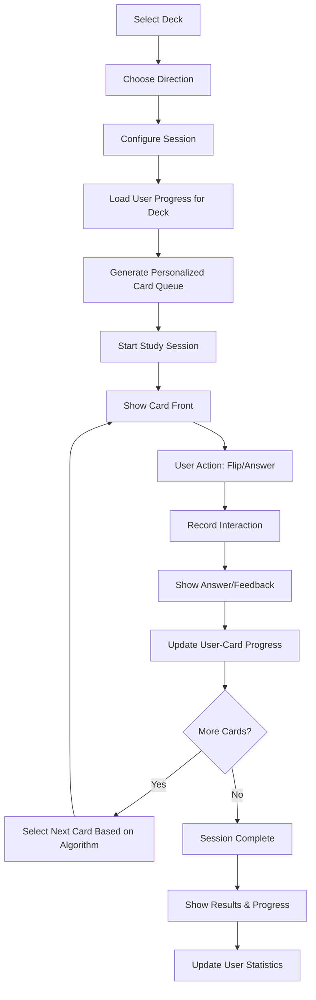
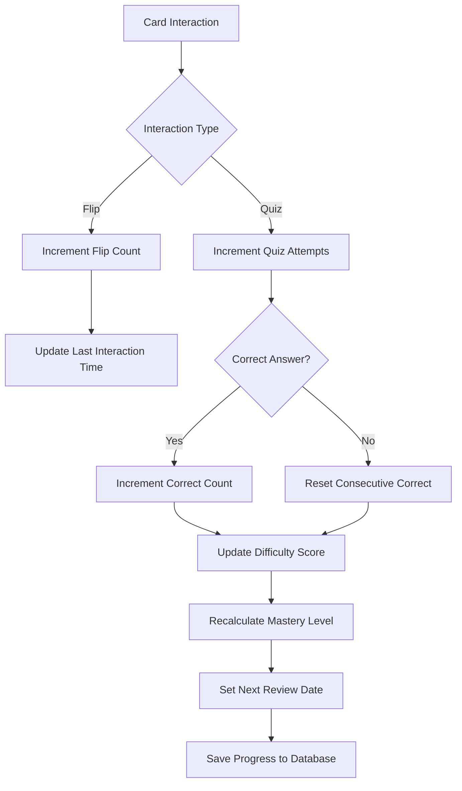
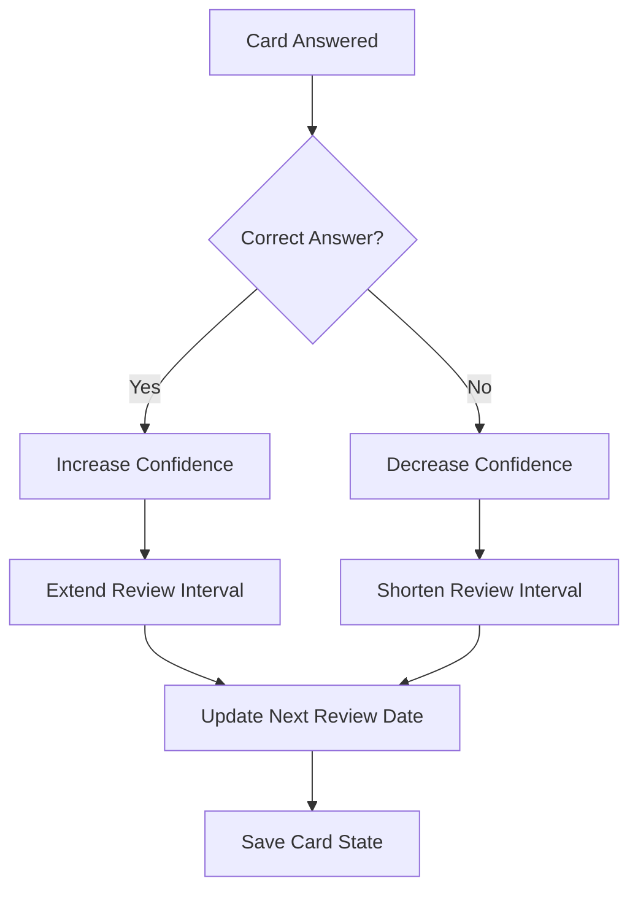
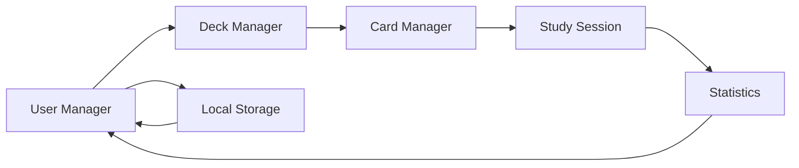

# Chinese-English Flashcard Web Application - Product Requirements

## Overview

A simple, focused web application for learning Chinese through flashcards. The app enables users to create, manage, and study Chinese-English flashcard decks with adaptive learning features. Following the KISS principle, the application prioritizes simplicity over complex implementation.

### Target Users
- Chinese language learners (beginner to intermediate)
- Students preparing for HSK exams
- Self-directed learners seeking vocabulary practice

### Core Value Proposition
- Simple flashcard creation and management
- Adaptive learning that focuses on difficult cards
- Bidirectional learning (Chinese→English, English→Chinese)
- Progress tracking and statistics
- Easy self-hosting on personal VPS
- CSV import/export for bulk card management

## Technology Stack & Dependencies

### Backend Architecture
- **Framework**: FastAPI (Python)
- **Database**: Supabase (PostgreSQL)
- **Authentication**: Supabase Auth with username/password
- **ORM**: SQLAlchemy or Supabase Python client
- **Server**: Uvicorn ASGI server

### Frontend Architecture
- **Rendering**: Server-side rendering with Jinja2 templates
- **Interactivity**: HTMX for dynamic interactions
- **Styling**: Tailwind CSS for utility-first styling
- **JavaScript**: Minimal vanilla JS for card flipping animations
- **Fonts**: Web fonts supporting Chinese characters

### Deployment Strategy
- **Self-hosting**: Single Docker container deployment
- **VPS Requirements**: Minimal (1GB RAM, 1 CPU core)
- **Static Files**: Served directly by FastAPI
- **Database**: Supabase hosted or self-hosted PostgreSQL

## Authentication & User Management

### Authentication System
- **Provider**: Supabase Auth
- **Method**: Username/password authentication
- **Session Management**: HTTP-only cookies
- **Security**: CSRF protection, password hashing

### User Profile Structure
```sql
CREATE TABLE users (
  id UUID PRIMARY KEY DEFAULT gen_random_uuid(),
  username VARCHAR(50) UNIQUE NOT NULL,
  email VARCHAR(255) UNIQUE NOT NULL,
  created_at TIMESTAMPTZ DEFAULT NOW(),
  last_active_at TIMESTAMPTZ DEFAULT NOW()
);

CREATE TABLE user_statistics (
  user_id UUID REFERENCES users(id) ON DELETE CASCADE,
  total_views INTEGER DEFAULT 0,
  total_correct_answers INTEGER DEFAULT 0,
  total_quiz_attempts INTEGER DEFAULT 0,
  study_time_minutes INTEGER DEFAULT 0,
  PRIMARY KEY (user_id)
);
```

### User Operations
- User registration with username/password
- Login/logout functionality
- Session persistence
- Password reset (future enhancement)
- User profile management

## Data Models & Database Schema

### Database Tables

```sql
CREATE TABLE decks (
  id UUID PRIMARY KEY DEFAULT gen_random_uuid(),
  user_id UUID REFERENCES users(id) ON DELETE CASCADE,
  name VARCHAR(100) NOT NULL,
  description TEXT,
  created_at TIMESTAMPTZ DEFAULT NOW(),
  last_studied_at TIMESTAMPTZ,
  total_study_time INTEGER DEFAULT 0
);

CREATE TABLE cards (
  id UUID PRIMARY KEY DEFAULT gen_random_uuid(),
  deck_id UUID REFERENCES decks(id) ON DELETE CASCADE,
  hanzi TEXT NOT NULL,
  pinyin TEXT NOT NULL,
  english TEXT NOT NULL,
  created_at TIMESTAMPTZ DEFAULT NOW()
);

-- User-specific card learning progress
CREATE TABLE user_card_progress (
  id UUID PRIMARY KEY DEFAULT gen_random_uuid(),
  user_id UUID REFERENCES users(id) ON DELETE CASCADE,
  card_id UUID REFERENCES cards(id) ON DELETE CASCADE,
  
  -- Flip tracking
  flip_count INTEGER DEFAULT 0,
  first_flipped_at TIMESTAMPTZ,
  last_flipped_at TIMESTAMPTZ,
  
  -- Quiz tracking
  quiz_attempts INTEGER DEFAULT 0,
  quiz_correct INTEGER DEFAULT 0,
  last_quiz_attempt_at TIMESTAMPTZ,
  
  -- Learning metrics
  difficulty_score REAL DEFAULT 1.0,  -- Calculated from performance
  mastery_level INTEGER DEFAULT 0,    -- 0=new, 1=learning, 2=review, 3=mastered
  next_review_at TIMESTAMPTZ DEFAULT NOW(),
  
  -- Performance tracking
  consecutive_correct INTEGER DEFAULT 0,
  total_study_time INTEGER DEFAULT 0, -- seconds spent on this card
  
  created_at TIMESTAMPTZ DEFAULT NOW(),
  updated_at TIMESTAMPTZ DEFAULT NOW(),
  
  UNIQUE(user_id, card_id)
);

CREATE TABLE study_sessions (
  id UUID PRIMARY KEY DEFAULT gen_random_uuid(),
  user_id UUID REFERENCES users(id) ON DELETE CASCADE,
  deck_id UUID REFERENCES decks(id) ON DELETE CASCADE,
  direction VARCHAR(20) NOT NULL, -- 'chinese_to_english' or 'english_to_chinese'
  cards_studied INTEGER DEFAULT 0,
  correct_answers INTEGER DEFAULT 0,
  session_duration INTEGER DEFAULT 0, -- minutes
  created_at TIMESTAMPTZ DEFAULT NOW()
);

-- Track individual card interactions within sessions
CREATE TABLE card_interactions (
  id UUID PRIMARY KEY DEFAULT gen_random_uuid(),
  session_id UUID REFERENCES study_sessions(id) ON DELETE CASCADE,
  user_id UUID REFERENCES users(id) ON DELETE CASCADE,
  card_id UUID REFERENCES cards(id) ON DELETE CASCADE,
  interaction_type VARCHAR(20) NOT NULL, -- 'flip', 'quiz_correct', 'quiz_incorrect'
  direction VARCHAR(20), -- for quiz interactions
  response_time INTEGER, -- milliseconds
  created_at TIMESTAMPTZ DEFAULT NOW()
);
```

### FastAPI Models (Pydantic)
```python
class CardCreate(BaseModel):
    hanzi: str
    pinyin: str
    english: str

class CardResponse(BaseModel):
    id: UUID
    hanzi: str
    pinyin: str
    english: str
    # User-specific progress (when authenticated)
    user_progress: Optional['UserCardProgress'] = None

class UserCardProgress(BaseModel):
    flip_count: int
    quiz_attempts: int
    quiz_correct: int
    difficulty_score: float
    mastery_level: int
    next_review_at: datetime
    accuracy_rate: float  # Calculated field

class DeckCreate(BaseModel):
    name: str
    description: Optional[str] = None

class DeckResponse(BaseModel):
    id: UUID
    name: str
    description: Optional[str]
    card_count: int
    last_studied_at: Optional[datetime]
    # User-specific deck progress
    user_progress: Optional['UserDeckProgress'] = None

class UserDeckProgress(BaseModel):
    cards_new: int
    cards_learning: int
    cards_review: int
    cards_mastered: int
    average_accuracy: float
```

## Feature Architecture

### 1. User Management Module

#### User Selection/Creation Page
- List existing users with basic stats
- "Create New User" button
- User deletion with confirmation dialog
- Simple form validation

#### User Profile Display
- Username and creation date
- Study statistics overview
- Number of decks and total cards

### 2. Deck Management Module

#### Deck List View
- Grid/list of user's decks
- Deck preview (name, card count, last studied)
- Quick action buttons (Study, Edit, Delete)

#### Deck Creation/Editing
- Simple form: name, description
- Card count display
- Deck deletion with confirmation

### 3. Card Management Module

#### Card List View (within deck)
- Paginated card display
- Search/filter by hanzi, pinyin, or English
- Quick edit inline editing
- Bulk selection for deletion

### Card Creation/Editing Form
- Three input fields: Hanzi, Pinyin, English
- Input validation (required fields)
- Character input support for Chinese
- Save and add another option

## Import/Export Functionality

### CSV Import Features
- Bulk card import from CSV files
- Expected CSV format: `hanzi,pinyin,english`
- Data validation during import
- Import preview before confirmation
- Error reporting for invalid entries

### CSV Export Features
- Export entire deck to CSV
- Export filtered cards (e.g., difficult cards only)
- Include metadata (view count, correct count, difficulty score)
- Download functionality via browser

### CSV Operations Implementation
```python
class CSVHandler:
    def import_cards(self, deck_id: UUID, csv_file) -> ImportResult:
        # Parse CSV, validate data, create cards
        pass
    
    def export_deck(self, deck_id: UUID, include_stats: bool = False) -> str:
        # Generate CSV content for deck
        pass
```

### HTMX Integration for File Operations
- File upload with progress indication
- Preview imported cards before saving
- Immediate feedback on export completion

### 4. Learning Mode Module

#### Study Session Configuration
- Select deck to study
- Choose direction: Chinese→English or English→Chinese
- Set session length (number of cards or time limit)

#### Flashcard Interface
- Card display with flip animation
- Large, readable text with proper Chinese font rendering
- Navigation buttons (Previous, Next, Mark as Known/Unknown)
- Progress indicator showing position in session
- User-specific progress indicators (mastery level, accuracy)

#### Quiz Mode
- Multiple choice questions (4 options)
- Immediate feedback (correct/incorrect)
- Score tracking during session
- Response time measurement
- Adaptive question selection based on user-card progress
- Future: Voice recognition for Chinese pronunciation

### 5. Adaptive Learning Algorithm

#### User-Card Level Learning System
- Track individual user progress for each card
- Personalized difficulty scoring based on user performance
- Multiple interaction types: card flips and quiz attempts
- Mastery levels: New → Learning → Review → Mastered

#### Difficulty Score Calculation (Per User-Card)
```python
class LearningAlgorithm:
    def update_card_progress(self, user_id: UUID, card_id: UUID, 
                           interaction_type: str, is_correct: bool = None):
        progress = get_user_card_progress(user_id, card_id)
        
        if interaction_type == "flip":
            progress.flip_count += 1
            progress.last_flipped_at = datetime.now()
            if progress.first_flipped_at is None:
                progress.first_flipped_at = datetime.now()
                
        elif interaction_type in ["quiz_correct", "quiz_incorrect"]:
            progress.quiz_attempts += 1
            progress.last_quiz_attempt_at = datetime.now()
            
            if is_correct:
                progress.quiz_correct += 1
                progress.consecutive_correct += 1
                # Reduce difficulty (less frequent appearance)
                progress.difficulty_score = max(0.1, progress.difficulty_score * 0.85)
            else:
                progress.consecutive_correct = 0
                # Increase difficulty (more frequent appearance)
                progress.difficulty_score = min(5.0, progress.difficulty_score * 1.4)
            
            # Update mastery level based on performance
            self.update_mastery_level(progress)
        
        progress.updated_at = datetime.now()
        return progress
    
    def update_mastery_level(self, progress):
        accuracy = progress.quiz_correct / max(1, progress.quiz_attempts)
        
        if progress.quiz_attempts >= 10 and accuracy >= 0.9:
            progress.mastery_level = 3  # Mastered
        elif progress.quiz_attempts >= 5 and accuracy >= 0.7:
            progress.mastery_level = 2  # Review
        elif progress.quiz_attempts >= 2:
            progress.mastery_level = 1  # Learning
        else:
            progress.mastery_level = 0  # New
```

#### Card Selection Algorithm (User-Specific)
```python
def select_next_cards_for_user(user_id: UUID, deck_id: UUID, count: int = 10):
    # Get all cards in deck with user progress
    cards_with_progress = get_deck_cards_with_user_progress(user_id, deck_id)
    
    # Prioritize by mastery level and difficulty score
    def get_priority_score(card_progress):
        base_score = card_progress.difficulty_score
        
        # Boost new cards
        if card_progress.mastery_level == 0:
            base_score *= 2.0
        
        # Boost overdue review cards
        if card_progress.next_review_at <= datetime.now():
            base_score *= 1.5
        
        # Reduce priority for mastered cards
        if card_progress.mastery_level == 3:
            base_score *= 0.3
        
        return base_score
    
    # Weight selection by priority scores
    priorities = [get_priority_score(cp) for cp in cards_with_progress]
    selected = random.choices(cards_with_progress, weights=priorities, k=count)
    
    return selected
```

### Future Enhancements
- Audio pronunciation for Chinese characters
- Voice recognition for pronunciation practice
- Advanced spaced repetition algorithms
- Mobile app companion
- Collaborative deck sharing

### 6. Statistics & Progress Tracking

#### User Statistics Dashboard
- Total cards studied across all decks
- Overall accuracy rate (quiz performance)
- Study streak (consecutive days)
- Time spent studying
- Cards by mastery level distribution
- Progress graphs showing improvement over time

#### Deck-Specific Statistics  
- Card mastery distribution (New/Learning/Review/Mastered)
- Accuracy rate per deck
- Time spent per deck
- Most difficult cards (lowest accuracy)
- Progress timeline

#### Individual Card Analytics
- Flip count and quiz attempts
- Accuracy rate over time
- Time to mastery progression
- Learning velocity (attempts per mastery level)
- Performance comparison with other users (aggregated/anonymous)

## User Interface Design

### Navigation Structure
```
Header Navigation:
├── User Selector
├── My Decks
├── Study Mode
└── Statistics

Main Content Area:
├── Dashboard (default)
├── Deck Management
├── Card Management
└── Learning Interface
```

### Responsive Design
- Mobile-first approach
- Touch-friendly buttons for mobile devices
- Readable fonts on all screen sizes
- Simple grid layouts

### Visual Design Principles
- Clean, minimal interface
- High contrast for readability
- Chinese character rendering optimization
- Consistent spacing and typography

## Learning Flow Architecture

### Study Session Workflow (Updated for User-Card Tracking)


### User-Card Progress Update Flow


### Adaptive Learning Flow


## Data Flow Between Components

### State Management
- Central store for user data
- Local component state for UI interactions
- Persistent storage synchronization

### Component Communication


## Testing Strategy

### Unit Testing Focus Areas
- Card/deck CRUD operations
- Learning algorithm calculations
- Data validation functions
- LocalStorage operations

### Manual Testing Scenarios
- User workflow end-to-end
- Chinese character input/display
- Mobile device compatibility
- Data persistence across sessions

### Performance Considerations
- Efficient card shuffling for large decks
- Optimized Chinese font loading
- Smooth card flip animations
- LocalStorage size management

## Technical Implementation Guidelines

### Project Structure
```
app/
├── main.py                 # FastAPI application entry
├── auth/
│   ├── __init__.py
│   ├── router.py          # Auth routes
│   └── dependencies.py    # Auth dependencies
├── models/
│   ├── __init__.py
│   ├── database.py        # SQLAlchemy models
│   └── schemas.py         # Pydantic schemas
├── routers/
│   ├── __init__.py
│   ├── decks.py          # Deck management routes
│   ├── cards.py          # Card management routes
│   ├── study.py          # Study session routes
│   └── import_export.py  # CSV import/export
├── services/
│   ├── __init__.py
│   ├── supabase.py       # Supabase client
│   ├── learning.py       # Learning algorithm
│   └── csv_handler.py    # CSV operations
├── templates/
│   ├── base.html
│   ├── auth/
│   ├── decks/
│   ├── cards/
│   └── study/
├── static/
│   ├── css/
│   │   └── tailwind.css
│   └── js/
│       └── app.js
└── utils/
    ├── __init__.py
    └── helpers.py
```

### Key Development Principles
- Follow FastAPI best practices
- Use HTMX for progressive enhancement
- Implement responsive design with Tailwind
- Minimize JavaScript dependencies
- Focus on server-side rendering for SEO
- Ensure easy VPS deployment

### API Endpoint Structure
```python
# Authentication
POST /auth/login
POST /auth/logout
POST /auth/register

# Deck Management
GET /decks                    # List user's decks
POST /decks                   # Create new deck
GET /decks/{deck_id}          # View deck details
PUT /decks/{deck_id}          # Update deck
DELETE /decks/{deck_id}       # Delete deck

# Card Management
GET /decks/{deck_id}/cards    # List deck's cards
POST /decks/{deck_id}/cards   # Add new card
PUT /cards/{card_id}          # Update card
DELETE /cards/{card_id}       # Delete card

# Study Sessions
GET /study/{deck_id}          # Start study session
POST /study/answer            # Submit answer
GET /study/next               # Get next card

# Import/Export
POST /decks/{deck_id}/import  # Import CSV
GET /decks/{deck_id}/export   # Export CSV

# Statistics
GET /stats/user               # User statistics
GET /stats/deck/{deck_id}     # Deck statistics
```

### Data Validation Rules
- Hanzi: Required, supports Chinese characters and punctuation
- Pinyin: Required, supports alphanumeric with tone marks
- English: Required, reasonable length limit (500 chars)
- Username: Required, alphanumeric, 3-50 characters
- Deck names: Required, unique per user, 1-100 characters

### Self-Hosting Requirements
- **Minimum VPS**: 1GB RAM, 1 CPU core, 10GB storage
- **Docker Support**: Single container deployment
- **Environment Variables**: Database URL, secret keys
- **Backup Strategy**: Database dumps, CSV exports
- **Monitoring**: Health check endpoints

### Deployment Configuration
```dockerfile
FROM python:3.11-slim
WORKDIR /app
COPY requirements.txt .
RUN pip install -r requirements.txt
COPY . .
EXPOSE 8000
CMD ["uvicorn", "main:app", "--host", "0.0.0.0", "--port", "8000"]
```

### Performance Optimization
- Database connection pooling
- Efficient card selection queries
- Static file caching
- Compressed CSS/JS delivery
- Pagination for large card sets

### Self-Hosting Requirements
- **Minimum VPS**: 1GB RAM, 1 CPU core, 10GB storage
- **Docker Support**: Single container deployment
- **Environment Variables**: Database URL, secret keys
- **Backup Strategy**: Database dumps, CSV exports
- **Monitoring**: Health check endpoints

### Deployment Configuration
```dockerfile
FROM python:3.11-slim
WORKDIR /app
COPY requirements.txt .
RUN pip install -r requirements.txt
COPY . .
EXPOSE 8000
CMD ["uvicorn", "main:app", "--host", "0.0.0.0", "--port", "8000"]
```

### Performance Optimization
- Database connection pooling
- Efficient card selection queries
- Static file caching
- Compressed CSS/JS delivery
- Pagination for large card sets