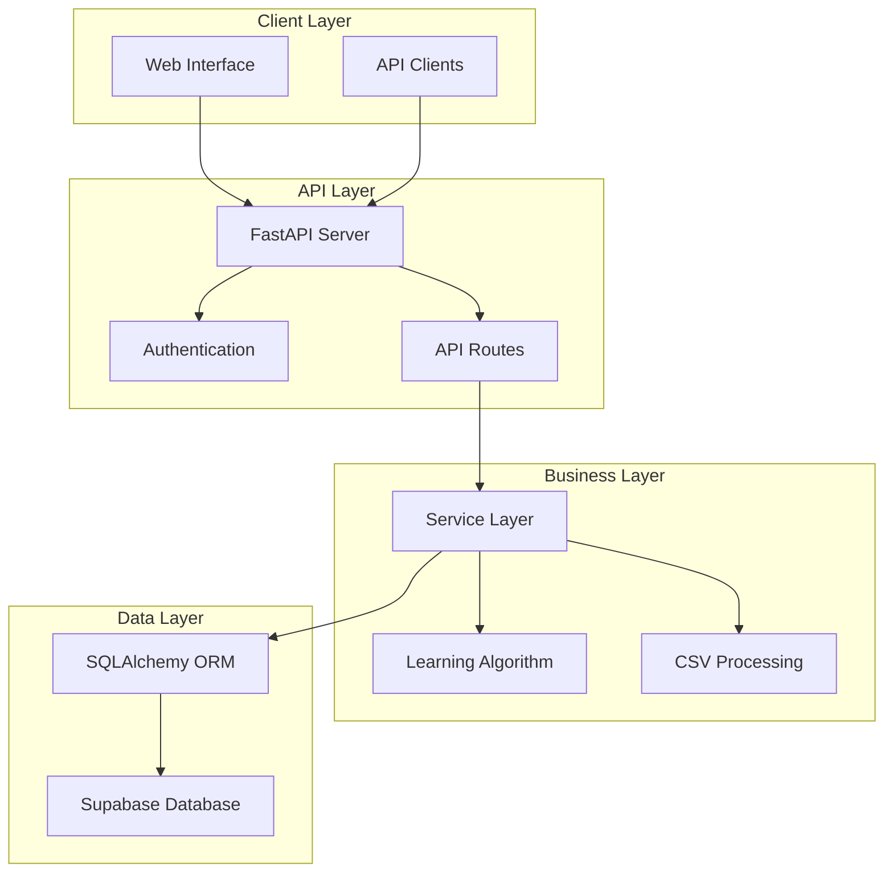

# Chinese Flashcards Application - Documentation

Welcome to the comprehensive documentation for the Chinese Flashcards application, a modern web application built with Python and FastAPI for learning Chinese vocabulary through interactive flashcards.

## 📚 Documentation Index

### Core Documentation
- [Project Overview](project-overview.md) - High-level architecture and system overview
- [Technology Stack](technology-stack.md) - Frameworks, libraries, and dependencies
- [Developer Guide](developer-guide.md) - Getting started guide for developers

### API Documentation
- [API Endpoints Reference](api/endpoints-reference.md) - Complete API documentation with examples
  - Authentication API
  - User Management API
  - Deck Management API
  - Card Management API
  - CSV Import/Export API
  - Study Session API
  - Statistics API

### Data Models & Database
- [Data Models & ORM Mapping](models/data-models-orm.md) - Database schema and relationships
  - Entity-Relationship Diagrams
  - Model Field Specifications
  - Relationships and Constraints
  - Pydantic Schemas

### Business Logic & Services
- [Business Logic Layer](services/business-logic-layer.md) - Service architecture and implementation
  - Service-Oriented Architecture
  - User Service
  - Deck Service
  - Card Service
  - CSV Service
  - Learning Service
  - Study Service
  - Statistics Service
  - Authentication Service

### Configuration & Environment
- [Configuration & Environment](configuration/config-environment.md) - Setup and configuration
  - Environment Variables
  - Database & Data Access
  - Authentication & Security
  - Development vs Production

### Operations & Deployment
- [Learning Algorithm](operations/learning-algorithm.md) - Adaptive learning implementation
- [CSV Import/Export](operations/csv-import-export.md) - Bulk data operations
- [Testing Strategy](operations/testing-strategy.md) - Testing approach and best practices
- [Deployment & Operations](operations/deployment-operations.md) - Production deployment guide

## 🚀 Quick Start

### For Developers
1. Read the [Project Overview](project-overview.md) to understand the architecture
2. Follow the [Developer Guide](developer-guide.md) for setup instructions
3. Review the [API Endpoints Reference](api/endpoints-reference.md) for available endpoints
4. Check the [Configuration Guide](configuration/config-environment.md) for environment setup

### For API Users
1. Start with [API Endpoints Reference](api/endpoints-reference.md)
2. Review authentication requirements in [Configuration & Environment](configuration/config-environment.md)
3. See [CSV Import/Export](operations/csv-import-export.md) for bulk operations

### For DevOps Engineers
1. Read [Deployment & Operations](operations/deployment-operations.md) for deployment strategies
2. Review [Configuration & Environment](configuration/config-environment.md) for environment setup
3. Check [Testing Strategy](operations/testing-strategy.md) for CI/CD integration

## 🏗️ Architecture Overview

The application follows a modern, layered architecture:

## 📖 Key Features

### Learning System
- **Adaptive Learning Algorithm**: Personalized card selection based on user performance
- **Spaced Repetition**: Optimized review intervals for long-term retention
- **Mastery Tracking**: Four-level mastery system (New, Learning, Review, Mastered)
- **Performance Analytics**: Detailed statistics and progress tracking

### Data Management
- **CSV Import/Export**: Bulk operations for easy data migration
- **Multi-language Support**: Full Unicode support for Chinese characters
- **Real-time Updates**: Live progress tracking during study sessions
- **Data Validation**: Comprehensive validation with detailed error reporting

### Security & Authentication
- **JWT-based Authentication**: Secure token-based authentication
- **Supabase Integration**: Robust user management and security
- **Role-based Access Control**: Users can only access their own data
- **CORS Protection**: Configurable cross-origin resource sharing

### Deployment & Operations
- **Containerized Deployment**: Docker and Docker Compose support
- **Environment Configuration**: Flexible configuration management
- **Health Monitoring**: Built-in health checks and monitoring
- **Scalable Architecture**: Designed for horizontal scaling

## 🔧 Technology Stack

### Backend
- **FastAPI**: Modern, fast web framework for building APIs
- **Python 3.13**: Latest Python with async/await support
- **SQLAlchemy**: Powerful ORM for database operations
- **Pydantic**: Data validation and settings management
- **Uvicorn**: Lightning-fast ASGI server

### Database & Authentication
- **Supabase**: Backend-as-a-service with PostgreSQL
- **PostgreSQL**: Robust relational database with full-text search
- **JWT**: JSON Web Tokens for stateless authentication

### Data Processing
- **pandas**: Efficient data manipulation for CSV operations
- **asyncio**: Asynchronous programming for better performance

### Deployment
- **Docker**: Containerization for consistent deployments
- **Nginx**: Reverse proxy and load balancing
- **Docker Compose**: Multi-container application orchestration

## 📋 Prerequisites

### Development Environment
- Python 3.13 or higher
- Docker and Docker Compose
- Git
- A Supabase account and project

### Production Environment
- Docker runtime
- Reverse proxy (Nginx recommended)
- SSL/TLS certificates
- Monitoring and logging infrastructure

## 🤝 Contributing

1. Read the [Developer Guide](developer-guide.md) for setup instructions
2. Review the [Testing Strategy](operations/testing-strategy.md) for testing guidelines
3. Follow the coding standards outlined in the documentation
4. Submit pull requests with comprehensive test coverage

## 📞 Support

For technical support and questions:
- Review the documentation thoroughly
- Check the [Troubleshooting Guide](operations/deployment-operations.md#troubleshooting-guide)
- Submit issues with detailed reproduction steps

## 📄 License

This project is licensed under the MIT License. See the LICENSE file for details.

---

*Last updated: January 2024*