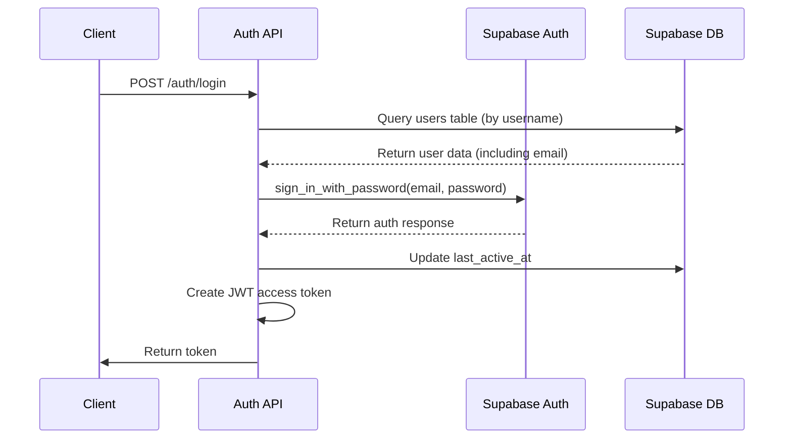

# API Endpoints Reference

This document provides comprehensive documentation for all API endpoints in the Chinese Flashcards application, including request/response schemas, authentication requirements, and usage examples.

## Table of Contents
1. [Authentication Endpoints](#authentication-endpoints)
2. [User Management API](#user-management-api)
3. [Deck Management API](#deck-management-api)
4. [Card Management API](#card-management-api)
5. [CSV Import/Export API](#csv-importexport-api)
6. [Study Session API](#study-session-api)
7. [Statistics API](#statistics-api)
8. [Security and Authentication Overview](#security-and-authentication-overview)
9. [Error Response Format](#error-response-format)

## Authentication Endpoints

Provides user registration, login, logout, and token management functionality.

### Register User
- **HTTP Method**: POST
- **URL**: `/api/auth/register`
- **Authentication**: None
- **Request Schema**: `UserCreate`
  - username: string (3-50 chars)
  - email: valid email format
  - password: string (min 6 chars)
- **Response Schema**: `UserResponse`
- **Status Codes**:
  - 201: User created successfully
  - 400: Username/email already exists
  - 422: Validation error

**Example Request:**
```json
{
  "username": "student123",
  "email": "student@example.com",
  "password": "securepassword"
}
```

**Example Response:**
```json
{
  "id": "a1b2c3d4-e5f6-7890-g1h2-i3j4k5l6m7n8",
  "username": "student123",
  "email": "student@example.com",
  "created_at": "2023-12-01T10:00:00Z",
  "last_active_at": "2023-12-01T10:00:00Z"
}
```

### Login User
- **HTTP Method**: POST
- **URL**: `/api/auth/login`
- **Authentication**: None
- **Request Schema**: `UserLogin`
  - username: string
  - password: string
- **Response Schema**: `TokenResponse`
- **Status Codes**:
  - 200: Login successful
  - 401: Invalid credentials
  - 422: Validation error

### Get Current User
- **HTTP Method**: GET
- **URL**: `/api/auth/me`
- **Authentication**: Bearer token required
- **Response Schema**: `UserResponse`
- **Status Codes**:
  - 200: User data retrieved
  - 401: Invalid or expired token

## User Management API

### Get User Profile
- **HTTP Method**: GET
- **URL**: `/api/users/me`
- **Authentication**: Bearer token required
- **Response Schema**: `UserResponse`

### Get User Statistics
- **HTTP Method**: GET
- **URL**: `/api/users/me/statistics`
- **Authentication**: Bearer token required
- **Response Schema**: `UserStatisticsResponse`

**Response Example:**
```json
{
  "total_views": 147,
  "total_correct_answers": 118,
  "total_quiz_attempts": 132,
  "study_time_minutes": 89,
  "accuracy_rate": 0.894
}
```

## Deck Management API

### Create Deck
- **HTTP Method**: POST
- **URL**: `/api/decks/`
- **Authentication**: Bearer token required
- **Request Schema**: `DeckCreate`
  - name: string (1-100 chars)
  - description: string (optional)
- **Response Schema**: `DeckResponse`
- **Status Codes**:
  - 201: Deck created successfully
  - 401: Authentication required
  - 422: Validation error

**Example Request:**
```json
{
  "name": "Spanish Verbs",
  "description": "Common irregular verbs"
}
```

**Example Response:**
```json
{
  "id": "a1b2c3d4-e5f6-7890-g1h2-i3j4k5l6m7n8",
  "name": "Spanish Verbs",
  "description": "Common irregular verbs",
  "created_at": "2023-12-01T10:00:00Z",
  "last_studied_at": null,
  "total_study_time": 0,
  "card_count": 0
}
```

### Get User Decks
- **HTTP Method**: GET
- **URL**: `/api/decks/`
- **Authentication**: Bearer token required
- **Response Schema**: `List[DeckResponse]`

### Get Deck by ID
- **HTTP Method**: GET
- **URL**: `/api/decks/{deck_id}`
- **Authentication**: Bearer token required
- **Response Schema**: `DeckResponse`
- **Status Codes**:
  - 200: Deck retrieved successfully
  - 404: Deck not found or access denied

### Update Deck
- **HTTP Method**: PUT
- **URL**: `/api/decks/{deck_id}`
- **Authentication**: Bearer token required
- **Request Schema**: `DeckUpdate`
- **Response Schema**: `DeckResponse`

### Delete Deck
- **HTTP Method**: DELETE
- **URL**: `/api/decks/{deck_id}`
- **Authentication**: Bearer token required
- **Status Codes**:
  - 204: Deck deleted successfully
  - 404: Deck not found or access denied

## Card Management API

### Create Card
- **HTTP Method**: POST
- **URL**: `/api/decks/{deck_id}/cards/`
- **Authentication**: Bearer token required
- **Request Schema**: `CardCreate`
  - hanzi: string (Chinese characters)
  - pinyin: string (pronunciation)
  - english: string (translation)
- **Response Schema**: `CardResponse`

**Example Request:**
```json
{
  "hanzi": "你好",
  "pinyin": "nǐ hǎo",
  "english": "hello"
}
```

### Get Deck Cards
- **HTTP Method**: GET
- **URL**: `/api/decks/{deck_id}/cards/`
- **Authentication**: Bearer token required
- **Query Parameters**:
  - limit: integer (default: 50)
  - offset: integer (default: 0)
  - search: string (optional)
- **Response Schema**: `List[CardResponse]`

### Get Card by ID
- **HTTP Method**: GET
- **URL**: `/api/cards/{card_id}`
- **Authentication**: Bearer token required
- **Response Schema**: `CardResponse`

### Update Card
- **HTTP Method**: PUT
- **URL**: `/api/cards/{card_id}`
- **Authentication**: Bearer token required
- **Request Schema**: `CardUpdate`
- **Response Schema**: `CardResponse`

### Delete Card
- **HTTP Method**: DELETE
- **URL**: `/api/cards/{card_id}`
- **Authentication**: Bearer token required
- **Status Codes**:
  - 204: Card deleted successfully
  - 404: Card not found or access denied

## CSV Import/Export API

### Import Cards from CSV
- **HTTP Method**: POST
- **URL**: `/api/csv/import/{deck_id}`
- **Authentication**: Bearer token required
- **Content-Type**: multipart/form-data
- **Parameters**:
  - file: CSV file (required columns: hanzi, pinyin, english)
  - validate_only: boolean (optional, default: false)
- **Response Schema**: `CSVImportResponse`

**CSV Format Example:**
```csv
hanzi,pinyin,english
你好,nǐ hǎo,hello
再见,zàijiàn,goodbye
谢谢,xièxie,thank you
```

### Export Deck to CSV
- **HTTP Method**: GET
- **URL**: `/api/csv/export/{deck_id}`
- **Authentication**: Bearer token required
- **Query Parameters**:
  - include_stats: boolean (optional, default: false)
- **Response**: CSV file download

### Export All Decks
- **HTTP Method**: GET
- **URL**: `/api/csv/export/all`
- **Authentication**: Bearer token required
- **Query Parameters**:
  - include_stats: boolean (optional, default: false)
- **Response**: CSV file download with deck_name column

### Download CSV Template
- **HTTP Method**: GET
- **URL**: `/api/csv/template`
- **Authentication**: None
- **Response**: CSV template file

## Study Session API

### Create Study Session
- **HTTP Method**: POST
- **URL**: `/api/study/session`
- **Authentication**: Bearer token required
- **Request Schema**: `StudySessionCreate`
  - deck_id: UUID
  - direction: string ("chinese_to_english" or "english_to_chinese")
- **Response Schema**: `StudySessionResponse`

### Get Study Cards
- **HTTP Method**: GET
- **URL**: `/api/study/session/{session_id}/cards`
- **Authentication**: Bearer token required
- **Query Parameters**:
  - count: integer (default: 10)
- **Response Schema**: `List[CardWithProgress]`

### Record Card Interaction
- **HTTP Method**: POST
- **URL**: `/api/study/interactions`
- **Authentication**: Bearer token required
- **Request Schema**: `CardInteractionCreate`
- **Response Schema**: `CardInteractionResponse`

### Generate Quiz Question
- **HTTP Method**: POST
- **URL**: `/api/study/quiz/question`
- **Authentication**: Bearer token required
- **Request Schema**: `QuizQuestionRequest`
- **Response Schema**: `QuizQuestionResponse`

### Submit Quiz Answer
- **HTTP Method**: POST
- **URL**: `/api/study/quiz/answer`
- **Authentication**: Bearer token required
- **Request Schema**: `QuizAnswerRequest`
- **Response Schema**: `QuizAnswerResponse`

### End Study Session
- **HTTP Method**: PUT
- **URL**: `/api/study/session/{session_id}/end`
- **Authentication**: Bearer token required
- **Request Schema**: `StudySessionEnd`
- **Response Schema**: `StudySessionResponse`

## Statistics API

### Get User Statistics
- **HTTP Method**: GET
- **URL**: `/api/statistics/user`
- **Authentication**: Bearer token required
- **Query Parameters**:
  - days: integer (default: 30)
- **Response Schema**: `UserStatisticsResponse`

### Get Deck Statistics
- **HTTP Method**: GET
- **URL**: `/api/statistics/deck/{deck_id}`
- **Authentication**: Bearer token required
- **Response Schema**: `DeckStatisticsResponse`

### Get Learning Progress Over Time
- **HTTP Method**: GET
- **URL**: `/api/statistics/progress`
- **Authentication**: Bearer token required
- **Query Parameters**:
  - days: integer (default: 30)
- **Response Schema**: `LearningProgressResponse`

## Security and Authentication Overview

### JWT Token Authentication
Most endpoints require authentication using JWT Bearer tokens. Include the token in the Authorization header:

```
Authorization: Bearer <your_jwt_token>
```

### Authentication Flow


### Protected Routes
All endpoints except the following require authentication:
- POST `/api/auth/register`
- POST `/api/auth/login`
- GET `/api/csv/template`
- GET `/` (home page)
- GET `/docs` (API documentation)

## Error Response Format

All API errors follow a consistent format:

```json
{
  "detail": "Error message description",
  "error_code": "SPECIFIC_ERROR_CODE",
  "status_code": 400
}
```

### Common Error Codes
- **400**: Bad Request - Invalid request data
- **401**: Unauthorized - Authentication required or token invalid
- **403**: Forbidden - Access denied
- **404**: Not Found - Resource not found
- **422**: Unprocessable Entity - Validation error
- **500**: Internal Server Error - Server-side error

### Validation Error Format
For validation errors (422), the response includes detailed field-level errors:

```json
{
  "detail": [
    {
      "loc": ["body", "email"],
      "msg": "field required",
      "type": "value_error.missing"
    },
    {
      "loc": ["body", "password"],
      "msg": "ensure this value has at least 8 characters",
      "type": "value_error.any_str.min_length"
    }
  ]
}
```

**Referenced Files:**
- [app/main.py](../app/main.py)
- [app/schemas/schemas.py](../app/schemas/schemas.py)
- [app/auth/auth_service.py](../app/auth/auth_service.py)
- [app/auth/router.py](../app/auth/router.py)
- [app/api/routes/users.py](../app/api/routes/users.py)
- [app/api/routes/decks.py](../app/api/routes/decks.py)
- [app/api/routes/csv.py](../app/api/routes/csv.py)
- [app/api/routes/study.py](../app/api/routes/study.py)
- [app/api/routes/statistics.py](../app/api/routes/statistics.py)