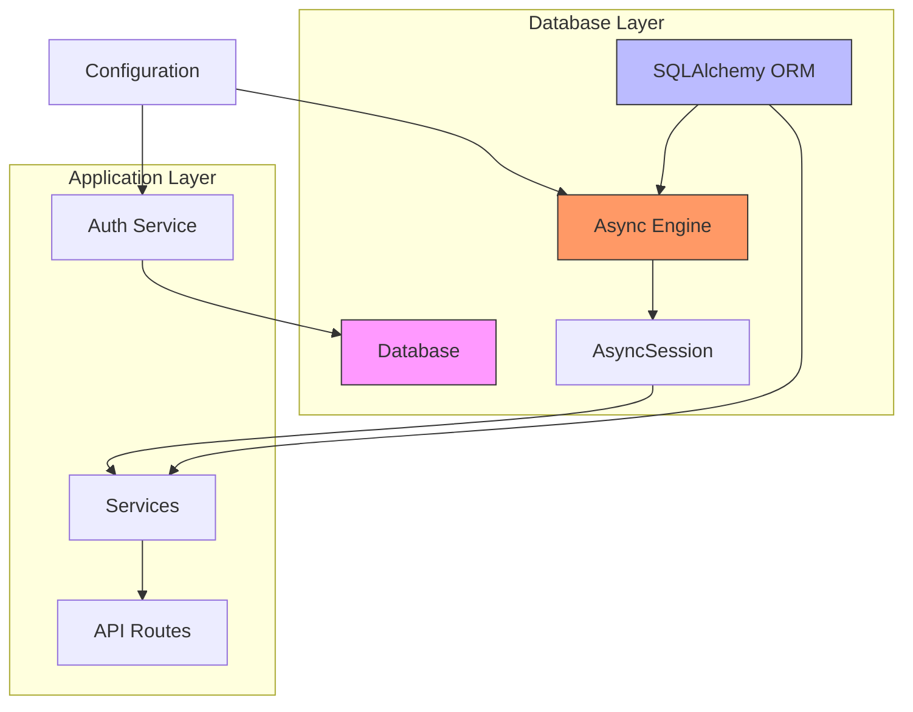
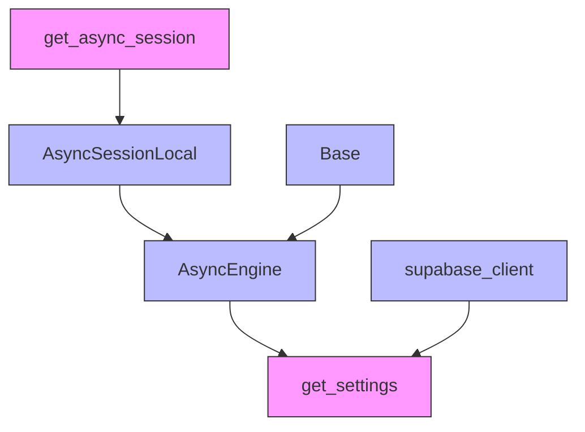
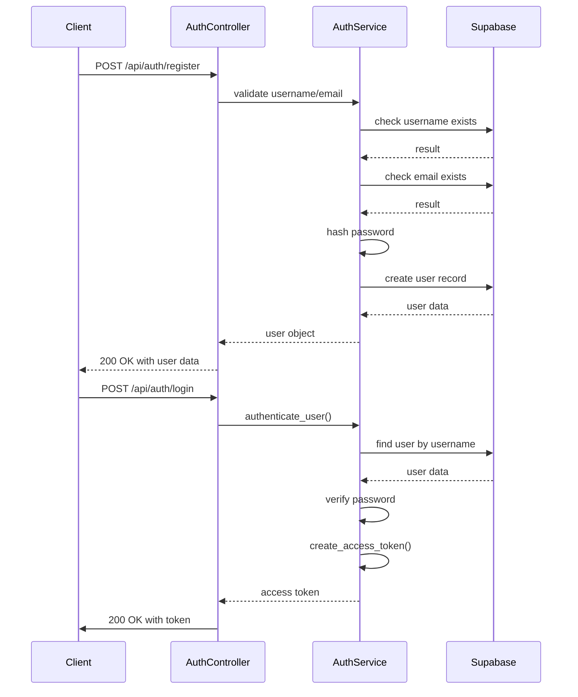

# Configuration & Environment

This document provides comprehensive documentation for configuration management, environment setup, database access, authentication, and security practices in the Chinese Flashcards application.

## Table of Contents
1. [Overview of Configuration System](#overview-of-configuration-system)
2. [Settings Class and Environment Loading](#settings-class-and-environment-loading)
3. [Configurable Settings Reference](#configurable-settings-reference)
4. [Database & Data Access](#database--data-access)
5. [Authentication & Security](#authentication--security)
6. [Development vs Production Configuration](#development-vs-production-configuration)
7. [Security Best Practices](#security-best-practices)
8. [Troubleshooting Common Configuration Issues](#troubleshooting-common-configuration-issues)

## Overview of Configuration System

The flashcards application uses Pydantic's `BaseSettings` class to manage configuration through environment variables, enabling flexible deployment across different environments such as development, staging, and production. Configuration values are loaded from a `.env` file by default but can be overridden by system environment variables, following the principle of least surprise and secure defaults.

This centralized configuration system ensures that sensitive credentials (like database URLs and JWT secrets) are never hardcoded and can be securely managed outside the codebase. The settings are lazily loaded and cached using Python's `lru_cache`, improving performance while maintaining consistency across the application lifecycle.

The configuration governs critical aspects including:
- Database connectivity
- Supabase authentication and client setup
- JWT-based security parameters
- CORS policies
- Application behavior based on environment mode

## Settings Class and Environment Loading

The core configuration is defined in the `Settings` class within `app/core/config.py`. This class inherits from `pydantic_settings.BaseSettings`, which automatically detects and loads environment variables, with fallback to values specified in the `.env` file.

```python
class Settings(BaseSettings):
    supabase_url: str
    supabase_service_key: str
    supabase_anon_key: str
    database_url: Optional[str] = None
    secret_key: str
    algorithm: str = "HS256"
    access_token_expire_minutes: int = 30
    environment: str = "development"
    debug: bool = False
    allowed_origins: List[str] = ["http://localhost:3000", "http://localhost:8080"]
```

### Environment Variable Resolution Order
1. **System environment variables** (highest priority)
2. **`.env` file** (project root or specified path)
3. **Default values** in the `Settings` model (lowest priority)

### Validation and Type Conversion
Custom validators ensure correct data types and formats:

```python
@validator("allowed_origins", pre=True)
def parse_cors_origins(cls, v):
    if isinstance(v, str):
        return [origin.strip() for origin in v.split(",")]
    return v
```

This allows `allowed_origins` to be provided as a comma-separated string or a JSON list.

### Configuration Injection
The configuration is injected into application components through the `get_settings()` function with caching:

```python
@lru_cache()
def get_settings() -> Settings:
    return Settings()
```

## Configurable Settings Reference

The following table lists all configurable settings, their purpose, default values, and usage context.

| Setting Key | Type | Default Value | Required | Description |
|------------|------|---------------|----------|-------------|
| **supabase_url** | `str` | — | Yes | Base URL for Supabase project (e.g., `https://abcde.supabase.co`) |
| **supabase_service_key** | `str` | — | Yes | Supabase service role key (full access) |
| **supabase_anon_key** | `str` | — | Yes | Supabase anonymous key (public access) |
| **database_url** | `Optional[str]` | `None` | No | Direct PostgreSQL connection URL; if absent, derived from Supabase URL |
| **secret_key** | `str` | — | Yes | Secret key for signing JWT tokens |
| **algorithm** | `str` | `"HS256"` | No | JWT signing algorithm |
| **access_token_expire_minutes** | `int` | `30` | No | Token expiration time in minutes |
| **environment** | `str` | `"development"` | No | Environment mode (`development`, `production`, etc.) |
| **debug** | `bool` | `False` | No | Enables debug logging and auto-reload |
| **allowed_origins** | `List[str]` | `["http://localhost:3000", "http://localhost:8080"]` | No | CORS origins allowed to access the API |

### Required Environment Variables

For production deployment, the following variables must be set:

**Supabase Configuration**
- `SUPABASE_URL`: The URL of the Supabase project
- `SUPABASE_SERVICE_KEY`: Service role key for administrative database operations
- `SUPABASE_ANON_KEY`: Anonymous key for client-side operations

**Authentication**
- `SECRET_KEY`: Cryptographic key for JWT token signing (must be strong and secret)
- `ALGORITHM`: JWT signing algorithm (default: HS256)
- `ACCESS_TOKEN_EXPIRE_MINUTES`: Token expiration time in minutes (default: 30)

### Optional Environment Variables
- `ENVIRONMENT`: Application environment (development, staging, production)
- `ALLOWED_ORIGINS`: Comma-separated list of allowed CORS origins
- `DEBUG`: Enable debug mode with detailed error messages

## Database & Data Access

### Project Structure
The application follows a layered architecture with clear separation of concerns. The database layer is organized across multiple modules:

- **app/core/database.py**: Centralized database connection, session management, and engine configuration
- **app/models/database.py**: SQLAlchemy ORM models defining the database schema and relationships
- **app/core/config.py**: Configuration settings including database and Supabase connection parameters
- **app/services/**: Business logic services that interact with the database through the ORM
- **app/auth/**: Authentication services that integrate Supabase Auth with relational data



### Database Connection Management
The application uses async SQLAlchemy with Supabase PostgreSQL:

```python
# Async database engine
engine = create_async_engine(
    database_url,
    echo=settings.debug,
    pool_pre_ping=True,
    pool_recycle=300
)

# Session factory
AsyncSessionLocal = async_sessionmaker(
    autocommit=False,
    autoflush=False,
    bind=engine,
    class_=AsyncSession
)
```

### Dependency Analysis


### ORM Models and Relationships
All relationships are enforced through foreign key constraints with `ON DELETE CASCADE` to maintain referential integrity:
- **User → Decks**: One-to-many, cascade delete
- **Deck → Cards**: One-to-many, cascade delete  
- **Card → UserCardProgress**: One-to-many, cascade delete
- **User → UserCardProgress**: One-to-many, cascade delete
- **StudySession → CardInteraction**: One-to-many, cascade delete

### Supabase Auth Integration
The application uses Supabase Auth for user authentication while storing extended user data in the PostgreSQL database:

```python
async def register_user(self, username: str, email: str, password: str) -> Optional[dict]:
    # Create user in Supabase Auth
    auth_response = self.supabase.auth.sign_up({
        "email": email,
        "password": password
    })
    
    # Create user record in our users table
    response = self.supabase.table("users").insert(user_data).execute()
```

## Authentication & Security

### Authentication System Overview
The authentication system leverages Supabase Auth for identity management while implementing additional security layers through JWT tokens and password hashing. The core components include the `AuthService` class, FastAPI dependency injection system, and configuration-driven security policies.

### JWT-based Authentication


### Route Protection and Dependency System
The application leverages FastAPI's dependency injection system to implement robust route protection through reusable security dependencies. The core of this system is the `get_current_user` dependency, which serves as middleware that validates authentication tokens on protected routes.

### Configuration Options
The authentication system is highly configurable through environment variables:

```python
class Settings(BaseSettings):
    # Authentication
    secret_key: str
    algorithm: str = "HS256"
    access_token_expire_minutes: int = 30
    
    # CORS Settings
    allowed_origins: List[str] = ["http://localhost:3000", "http://localhost:8080"]
    
    # Application
    environment: str = "development"
    debug: bool = False
```

### Security Features
- **Secure JWT-based authentication**
- **Password hashing and storage via Supabase**
- **Session management with token expiration**
- **Role-based access control**
- **CORS protection**
- **Environment-specific security policies**

## Development vs Production Configuration

### Development Configuration Example
```bash
# .env for development
ENVIRONMENT=development
DEBUG=true
SUPABASE_URL=https://your-project.supabase.co
SUPABASE_SERVICE_KEY=your-service-key
SUPABASE_ANON_KEY=your-anon-key
SECRET_KEY=your-development-secret-key
ALLOWED_ORIGINS=http://localhost:3000,http://localhost:8080
ACCESS_TOKEN_EXPIRE_MINUTES=60
```

### Production Configuration Example
```bash
# Production environment variables
ENVIRONMENT=production
DEBUG=false
SUPABASE_URL=https://your-prod-project.supabase.co
SUPABASE_SERVICE_KEY=your-prod-service-key
SUPABASE_ANON_KEY=your-prod-anon-key
SECRET_KEY=your-highly-secure-production-secret-key
ALLOWED_ORIGINS=https://yourdomain.com,https://app.yourdomain.com
ACCESS_TOKEN_EXPIRE_MINUTES=30
```

## Security Best Practices

### Secret Key Management
- **Generate strong secret keys** using `secrets.token_urlsafe(32)` or OpenSSL
- **Never hardcode secrets** in source code
- **Use different keys** for different environments
- **Rotate keys regularly** in production

### Environment Variables Security
- **Use `.env` files** for development (excluded from version control)
- **Use environment variables** for production deployment
- **Encrypt sensitive values** in CI/CD pipelines
- **Limit access** to production environment variables

### Database Security
- **Use connection pooling** to prevent connection exhaustion
- **Enable SSL/TLS** for database connections in production
- **Implement row-level security** through Supabase policies
- **Regular backups** and security updates

### CORS Configuration
- **Restrict origins** to known domains in production
- **Avoid wildcards** (`*`) in production CORS settings
- **Use HTTPS origins** for production

## Troubleshooting Common Configuration Issues

### Database Connection Problems
**Symptoms**: Connection timeouts or authentication failures

**Solutions**:
- Verify Supabase URL and keys are correct
- Check network connectivity to Supabase
- Ensure service key has appropriate permissions
- Test connection with direct PostgreSQL client

### Configuration Errors
**Symptoms**: Application behaves unexpectedly or shows configuration-related errors

**Common Issues**:
- **CORS errors**: Verify ALLOWED_ORIGINS includes your frontend domain
- **JWT errors**: Check SECRET_KEY consistency across deployments
- **Environment mix-up**: Ensure correct environment variables for each environment
- **Type conversion issues**: Verify boolean and list variables are properly formatted

### Performance Issues
**Symptoms**: Slow response times or timeouts

**Optimization Steps**:
- **Database indexing**: Add indexes to frequently queried columns
- **Connection pooling**: Implement database connection pooling
- **Caching**: Add Redis or similar cache for frequent queries
- **Resource limits**: Adjust container CPU and memory limits

### Configuration Validation
```python
# Example configuration test
from app.core.config import get_settings

def test_configuration():
    settings = get_settings()
    assert settings.supabase_url.startswith("https://")
    assert len(settings.secret_key) >= 32
    assert settings.access_token_expire_minutes > 0
```

**Referenced Files:**
- [app/core/config.py](../app/core/config.py)
- [app/core/database.py](../app/core/database.py)
- [app/auth/auth_service.py](../app/auth/auth_service.py)
- [app/main.py](../app/main.py)
- [Dockerfile](../Dockerfile)