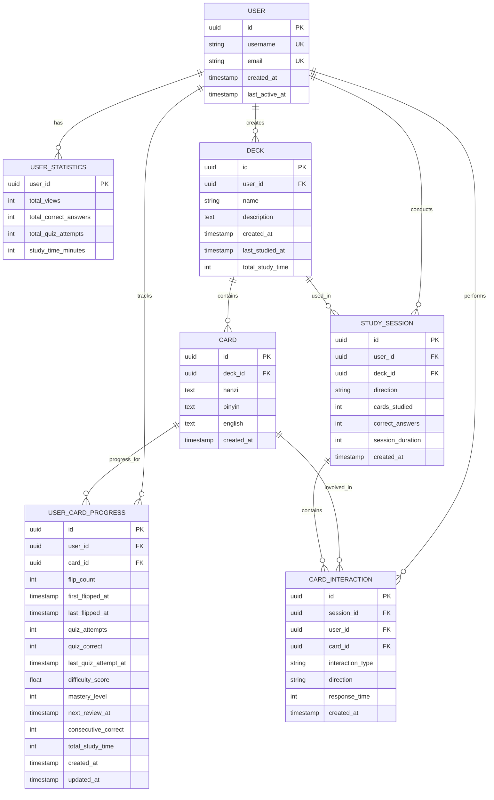
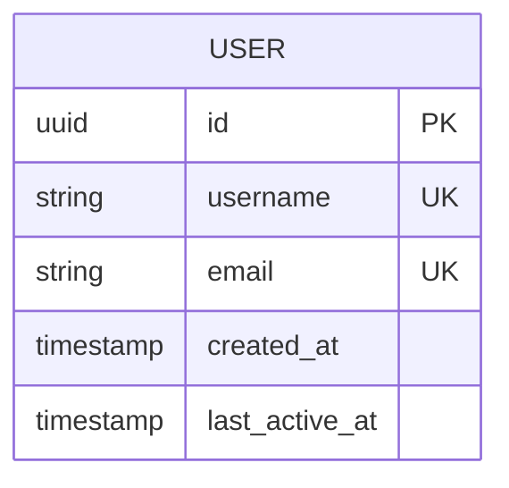

# Data Models & ORM Mapping

This document provides comprehensive documentation for all database models and ORM mapping configurations in the Chinese Flashcards application.

## Table of Contents
1. [Entity-Relationship Overview](#entity-relationship-overview)
2. [User Model](#user-model)
3. [Deck Model](#deck-model)
4. [Card Model](#card-model)
5. [User Card Progress Model](#user-card-progress-model)
6. [Study Session Model](#study-session-model)
7. [Card Interaction Model](#card-interaction-model)
8. [User Statistics Model](#user-statistics-model)
9. [Relationships and Constraints](#relationships-and-constraints)
10. [Pydantic Schemas](#pydantic-schemas)

## Entity-Relationship Overview

The complete database schema shows the relationships between all models in the flashcard application:

## User Model

The User model represents registered users of the flashcard application and integrates with Supabase Auth for authentication.

### Field Specifications
- **id**: `Mapped[uuid.UUID]` - Primary key, auto-generated UUID
- **username**: `Mapped[str]` - Unique username (3-50 characters)
- **email**: `Mapped[str]` - Unique email address
- **created_at**: `Mapped[datetime]` - Account creation timestamp
- **last_active_at**: `Mapped[Optional[datetime]]` - Last login timestamp

### Primary Key and Constraints
- **Primary Key**: UUID ensures globally unique identifiers across distributed systems
- **Uniqueness Constraints**:
  - `username` has a unique constraint to prevent duplicate usernames
  - `email` also enforces uniqueness to avoid multiple accounts with the same email

### Relationships
The User model establishes several relationships with other entities:

- **decks**: One-to-Many relationship with Deck model
- **user_statistics**: One-to-One relationship with UserStatistics model
- **card_progress**: One-to-Many relationship with UserCardProgress model
- **study_sessions**: One-to-Many relationship with StudySession model
- **card_interactions**: One-to-Many relationship with CardInteraction model

### Integration with Supabase Auth
The User model integrates with Supabase Auth for secure user management:
- Users register via `AuthService.register_user()`, creating entries in both Supabase Auth and the local users table
- Login uses `AuthService.authenticate_user()` to verify credentials through Supabase
- JWT tokens are issued using `create_access_token()` upon successful login
- `last_active_at` is updated on successful authentication

## Deck Model

The Deck model represents collections of flashcards organized by topic or theme.

### Field Specifications
- **id**: `Mapped[uuid.UUID]` - Primary key, auto-generated UUID
- **user_id**: `Mapped[uuid.UUID]` - Foreign key to User
- **name**: `Mapped[str]` - Deck name (1-100 characters)
- **description**: `Mapped[Optional[str]]` - Optional deck description
- **created_at**: `Mapped[datetime]` - Creation timestamp
- **last_studied_at**: `Mapped[Optional[datetime]]` - Last study session timestamp
- **total_study_time**: `Mapped[int]` - Total time spent studying this deck (minutes)

### Relationships
- **User Relationship**: Many-to-One with User model
- **Cards Relationship**: One-to-Many with Card model (CASCADE delete)
- **Study Sessions Relationship**: One-to-Many with StudySession model

### Data Validation and Constraints
- **Primary Key**: `id` ensures each deck is uniquely identifiable
- **Foreign Key**: `user_id` references `users.id` with CASCADE delete
- **Not Null**: `id`, `user_id`, `name`, `created_at`, and `total_study_time` cannot be null

## Card Model

The Card model stores individual flashcard data with Chinese characters, pronunciation, and English translation.

### Field Specifications
- **id**: `Mapped[uuid.UUID]` - Primary key, auto-generated UUID
- **deck_id**: `Mapped[uuid.UUID]` - Foreign key to Deck
- **hanzi**: `Mapped[str]` - Chinese characters
- **pinyin**: `Mapped[str]` - Pinyin transcription
- **english**: `Mapped[str]` - English translation
- **created_at**: `Mapped[datetime]` - Creation timestamp

### Multilingual Content Storage
All language content fields use the Text data type to:
- Accommodate lengthy definitions and example sentences
- Support multi-character Chinese words and phrases
- Allow for proper Pinyin formatting with tone marks
- Provide flexibility for various vocabulary types

### Data Integrity and Constraints
- **CASCADE Delete Behavior**: When a deck is deleted, all associated cards are automatically removed
- **Primary Key Uniqueness**: UUID guarantees global uniqueness across all cards
- **Character Encoding**: UTF-8 encoding throughout the stack for proper Chinese character handling

## User Card Progress Model

The UserCardProgress model tracks individual user progress for each flashcard, enabling adaptive learning.

### Field Specifications
- **id**: `Mapped[uuid.UUID]` - Primary key, auto-generated UUID
- **user_id**: `Mapped[uuid.UUID]` - Foreign key to User
- **card_id**: `Mapped[uuid.UUID]` - Foreign key to Card
- **flip_count**: `Mapped[int]` - Number of times card was flipped
- **first_flipped_at**: `Mapped[Optional[datetime]]` - First flip timestamp
- **last_flipped_at**: `Mapped[Optional[datetime]]` - Last flip timestamp
- **quiz_attempts**: `Mapped[int]` - Number of quiz attempts
- **quiz_correct**: `Mapped[int]` - Number of correct quiz answers
- **last_quiz_attempt_at**: `Mapped[Optional[datetime]]` - Last quiz attempt timestamp
- **difficulty_score**: `Mapped[float]` - Adaptive difficulty score (0.1-5.0)
- **mastery_level**: `Mapped[int]` - 0=new, 1=learning, 2=review, 3=mastered
- **next_review_at**: `Mapped[datetime]` - Next scheduled review time
- **consecutive_correct**: `Mapped[int]` - Consecutive correct answers
- **total_study_time**: `Mapped[int]` - Time spent on this card (seconds)
- **created_at**: `Mapped[datetime]` - Record creation timestamp
- **updated_at**: `Mapped[datetime]` - Last update timestamp

### Mastery Level States
The **mastery_level** field drives the adaptive learning algorithm with four distinct states:
- **0 (New)**: Card has been introduced but not sufficiently practiced
- **1 (Learning)**: User has demonstrated basic understanding but needs reinforcement
- **2 (Review)**: User shows consistent performance; card enters periodic review
- **3 (Mastered)**: User has demonstrated long-term retention; minimal review needed

### Unique Constraint
The model enforces a unique constraint ensuring that each user-card pair has exactly one progress record, preventing duplicate progress tracking.

## Study Session Model

The StudySession model tracks individual study sessions, including metadata about the session and performance metrics.

### Field Specifications
- **id**: `Mapped[uuid.UUID]` - Primary key, auto-generated UUID
- **user_id**: `Mapped[uuid.UUID]` - Foreign key to User
- **deck_id**: `Mapped[uuid.UUID]` - Foreign key to Deck
- **direction**: `Mapped[str]` - Study direction ("chinese_to_english" or "english_to_chinese")
- **cards_studied**: `Mapped[int]` - Number of cards studied in session
- **correct_answers**: `Mapped[int]` - Number of correct quiz answers
- **session_duration**: `Mapped[int]` - Session length in minutes
- **created_at**: `Mapped[datetime]` - Session start timestamp

### Session Management
The study service maintains session state through this model, tracking:
- Real-time session progress
- Performance metrics
- Learning direction preferences
- Duration tracking for analytics

## Card Interaction Model

The CardInteraction model captures granular user interactions with flashcards during study sessions.

### Field Specifications
- **id**: `Mapped[uuid.UUID]` - Primary key, auto-generated UUID
- **session_id**: `Mapped[uuid.UUID]` - Foreign key to StudySession
- **user_id**: `Mapped[uuid.UUID]` - Foreign key to User
- **card_id**: `Mapped[uuid.UUID]` - Foreign key to Card
- **interaction_type**: `Mapped[str]` - Type of interaction ("flip", "quiz_correct", "quiz_incorrect")
- **direction**: `Mapped[Optional[str]]` - Learning direction for quiz interactions
- **response_time**: `Mapped[Optional[int]]` - Response time in milliseconds
- **created_at**: `Mapped[datetime]` - Interaction timestamp

### Relationships and Foreign Keys
The model establishes critical relationships with CASCADE delete behavior:
- **StudySession Relationship**: Links interactions to their parent session
- **User Relationship**: Enables user behavior analysis across sessions
- **Card Relationship**: Connects interactions to specific flashcards for performance analytics

### Performance Considerations
- **Write Optimization**: Supports rapid insertion during intensive study sessions
- **Atomic Operations**: Each interaction recording updates both interaction and user progress
- **Error Handling**: Robust error handling ensures failed recordings don't disrupt study flow

## User Statistics Model

The UserStatistics model maintains aggregate statistics for each user's learning progress.

### Field Specifications
- **user_id**: `Mapped[uuid.UUID]` - Primary key and foreign key to User
- **total_views**: `Mapped[int]` - Total number of card views
- **total_correct_answers**: `Mapped[int]` - Total correct quiz answers
- **total_quiz_attempts**: `Mapped[int]` - Total quiz attempts
- **study_time_minutes**: `Mapped[int]` - Total study time in minutes

### Dashboard Integration
The model directly supports frontend dashboard features:
- Progress overview with study time and quiz accuracy
- Motivational feedback and achievement milestones
- Visual analytics and learning progress charts
- Accuracy rate calculations (correct/total attempts)

## Relationships and Constraints

### Database Relationships
- **User → Deck**: One-to-many (cascade delete)
- **User → UserStatistics**: One-to-one (cascade delete)
- **User → UserCardProgress**: One-to-many (cascade delete)
- **User → StudySession**: One-to-many (cascade delete)
- **User → CardInteraction**: One-to-many (cascade delete)
- **Deck → Card**: One-to-many (cascade delete)
- **Deck → StudySession**: One-to-many (cascade delete)
- **Card → UserCardProgress**: One-to-many (cascade delete)
- **Card → CardInteraction**: One-to-many (cascade delete)
- **StudySession → CardInteraction**: One-to-many (cascade delete)

### Relationship Enforcement
All relationships are enforced through foreign key constraints with `ON DELETE CASCADE` to maintain referential integrity. The ORM uses SQLAlchemy's `relationship()` function to define bidirectional relationships with `back_populates` parameter ensuring synchronization.

## Pydantic Schemas

The application uses Pydantic schemas for API validation and serialization:

### User Schemas
- **UserBase**: Username and email validation
- **UserCreate**: Inherits UserBase, adds password field
- **UserResponse**: Full user data without sensitive fields

### Deck Schemas
- **DeckBase**: Name (1-100 chars) and optional description
- **DeckCreate**: Inherits DeckBase
- **DeckUpdate**: Optional name and description
- **DeckResponse**: Full deck data with card_count
- **DeckWithProgress**: DeckResponse with user_progress

### Card Schemas
- **CardBase**: hanzi, pinyin, english (all required)
- **CardCreate**: Inherits CardBase
- **CardUpdate**: Optional fields for all card attributes
- **CardResponse**: Full card data
- **CardWithProgress**: CardResponse with user_progress

### Progress and Session Schemas
- **UserCardProgressResponse**: All progress fields with calculated accuracy_rate
- **StudySessionCreate**: deck_id and direction validation
- **StudySessionResponse**: Full session data with calculated accuracy_rate
- **CardInteractionCreate**: Validates interaction_type and direction patterns

**Referenced Files:**
- [app/models/database.py](../app/models/database.py)
- [app/schemas/schemas.py](../app/schemas/schemas.py)
- [app/core/database.py](../app/core/database.py)