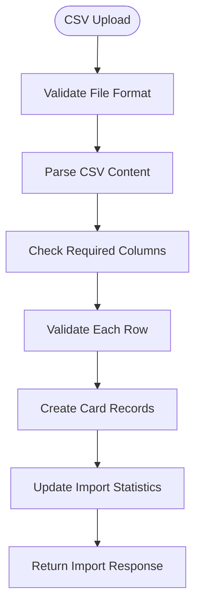
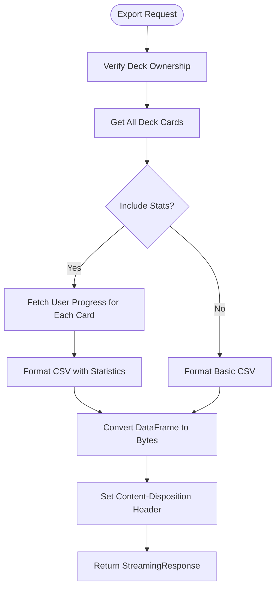
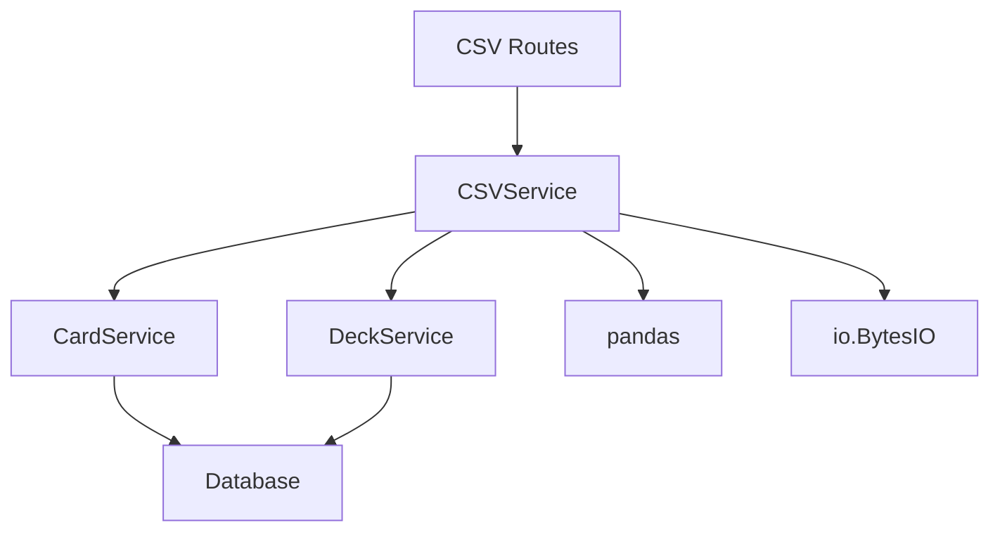

# CSV Import/Export

This document provides comprehensive documentation for the CSV import and export functionality in the Chinese Flashcards application.

## Table of Contents
1. [Overview](#overview)
2. [Import Process](#import-process)
3. [Export Functionality](#export-functionality)
4. [File Format Specifications](#file-format-specifications)
5. [Validation and Error Handling](#validation-and-error-handling)
6. [API Integration](#api-integration)
7. [Service Implementation](#service-implementation)

## Overview

The CSV import/export system enables users to manage flashcard data in bulk, facilitating easy migration from other learning platforms and backup of study materials. The system supports both basic card data and enhanced exports with learning statistics.

### Key Features
- **Bulk Import**: Create multiple cards from CSV files
- **Data Validation**: Comprehensive validation with detailed error reporting
- **Export Options**: Basic and enhanced exports with progress statistics
- **Template Support**: Downloadable CSV template for imports
- **Encoding Support**: UTF-8 primary with latin1 fallback

## Import Process

### Import Flow


### Validation Steps
1. **File Format Validation**: Ensure file is valid CSV
2. **Encoding Detection**: Try UTF-8, fallback to latin1
3. **Column Validation**: Verify required columns (hanzi, pinyin, english)
4. **Data Validation**: Check each row for completeness and format
5. **Duplicate Detection**: Identify potential duplicate cards

### Import API Endpoint
- **HTTP Method**: POST
- **URL**: `/api/csv/import/{deck_id}`
- **Content-Type**: multipart/form-data
- **Parameters**:
  - `file`: CSV file (required)
  - `validate_only`: boolean (optional, default: false)

### Request Example
```python
import requests

files = {'file': open('flashcards.csv', 'rb')}
response = requests.post(
    'http://localhost:8000/api/csv/import/deck-uuid',
    files=files,
    params={'validate_only': False},
    headers={'Authorization': 'Bearer your-token'}
)
```

### Response Format
```json
{
  "success": true,
  "imported_count": 25,
  "errors": [],
  "validated_cards": [
    {
      "hanzi": "你好",
      "pinyin": "nǐ hǎo",
      "english": "hello"
    }
  ]
}
```

## Export Functionality

### Export Process


### Export Options

#### Basic Export
- **Columns**: hanzi, pinyin, english, created_at
- **Usage**: Simple backup and migration
- **File Size**: Minimal

#### Enhanced Export with Statistics
- **Additional Columns**: 
  - flip_count
  - quiz_attempts
  - quiz_correct
  - accuracy_rate
  - mastery_level
  - difficulty_score
  - next_review_at
- **Usage**: Complete learning data backup
- **File Size**: Larger due to progress data

### Export API Endpoints

#### Single Deck Export
- **HTTP Method**: GET
- **URL**: `/api/csv/export/{deck_id}`
- **Query Parameters**:
  - `include_stats`: boolean (optional, default: false)

#### All Decks Export
- **HTTP Method**: GET
- **URL**: `/api/csv/export/all`
- **Query Parameters**:
  - `include_stats`: boolean (optional, default: false)
- **Additional Column**: deck_name (identifies source deck)

#### Template Download
- **HTTP Method**: GET
- **URL**: `/api/csv/template`
- **Authentication**: None required
- **Response**: CSV template with example data

## File Format Specifications

### Basic CSV Format
```csv
hanzi,pinyin,english
你好,nǐ hǎo,hello
再见,zàijiàn,goodbye
谢谢,xièxie,thank you
对不起,duìbuqǐ,sorry
没关系,méi guānxi,no problem
```

### Enhanced CSV Format (with statistics)
```csv
hanzi,pinyin,english,flip_count,quiz_attempts,quiz_correct,accuracy_rate,mastery_level,difficulty_score,next_review_at
你好,nǐ hǎo,hello,5,3,3,1.0,2,0.8,2024-01-15T10:00:00Z
再见,zàijiàn,goodbye,2,1,0,0.0,0,2.5,2024-01-10T15:30:00Z
谢谢,xièxie,thank you,8,6,5,0.83,2,1.2,2024-01-20T09:00:00Z
```

### Multi-Deck Export Format
```csv
deck_name,hanzi,pinyin,english
HSK Level 1,你好,nǐ hǎo,hello
HSK Level 1,再见,zàijiàn,goodbye
HSK Level 2,学校,xuéxiào,school
HSK Level 2,老师,lǎoshī,teacher
```

### Required Columns
- **hanzi**: Chinese characters (required, non-empty)
- **pinyin**: Romanized pronunciation (required, non-empty)
- **english**: English translation (required, non-empty)

### Optional Columns (import)
- **created_at**: Timestamp (auto-generated if not provided)

## Validation and Error Handling

### Field Validation
The service performs comprehensive validation:
- **Required Headers**: Checks for presence of hanzi, pinyin, english columns
- **Non-Empty Values**: Validates that required fields contain data
- **Character Encoding**: Handles UTF-8 and latin1 encoded files
- **CSV Structure**: Detects malformed CSV files

### Error Types and Messages
```python
# Example error responses:
error_messages = [
    "Line 5: Missing required fields (hanzi, pinyin, english)",
    "Line 8: Empty values not allowed",
    "Missing required columns: hanzi, pinyin",
    "File processing error: UTF-8 decoding failed",
    "Line 12: Invalid character encoding in hanzi field"
]
```

### Validation Response Schema
```python
class CSVImportResponse(BaseModel):
    success: bool
    imported_count: int
    errors: List[str]
    validated_cards: Optional[List[dict]] = None
```

### Error Handling Strategy
- **Graceful Failure**: Continue processing valid rows even if some fail
- **Detailed Reporting**: Line-by-line error reporting for debugging
- **Rollback Option**: Validate-only mode for checking before import
- **Encoding Fallback**: Automatic fallback to latin1 if UTF-8 fails

## API Integration

### Service Dependencies


The CSV Service integrates with multiple components:
- **CardService**: For creating and retrieving card data
- **DeckService**: For deck validation and metadata
- **pandas**: For efficient CSV processing and data manipulation
- **FastAPI**: For file upload handling and streaming responses

### Dependency Injection
```python
@router.post("/import/{deck_id}")
async def import_csv(
    deck_id: uuid.UUID,
    file: UploadFile = File(...),
    validate_only: bool = False,
    current_user: dict = Depends(get_current_user),
    csv_service: CSVService = Depends(get_csv_service)
):
    return await csv_service.import_cards_from_csv(
        deck_id, file, current_user["id"], validate_only
    )
```

## Service Implementation

### Core Methods
```python
class CSVService:
    async def import_cards_from_csv(self, deck_id: uuid.UUID, file: UploadFile, 
                                  user_id: uuid.UUID, validate_only: bool) -> CSVImportResponse
    
    async def export_deck_to_csv(self, deck_id: uuid.UUID, user_id: uuid.UUID, 
                                include_stats: bool) -> BytesIO
    
    async def export_all_decks_to_csv(self, user_id: uuid.UUID, 
                                    include_stats: bool) -> BytesIO
    
    async def get_csv_template(self) -> BytesIO
```

### Performance Considerations
- **Streaming Processing**: Large files processed in chunks
- **Memory Management**: Efficient memory usage for large CSV files
- **Database Optimization**: Batch operations for card creation
- **Response Streaming**: Large exports streamed to client

### Error Recovery
- **Transaction Management**: Ensure data consistency during imports
- **Partial Success Handling**: Report both successes and failures
- **Cleanup Operations**: Remove partially imported data on complete failure
- **Retry Logic**: Built-in retry for temporary database issues

**Referenced Files:**
- [app/api/routes/csv.py](../app/api/routes/csv.py)
- [app/services/csv_service.py](../app/services/csv_service.py)
- [app/services/card_service.py](../app/services/card_service.py)
- [app/schemas/schemas.py](../app/schemas/schemas.py)