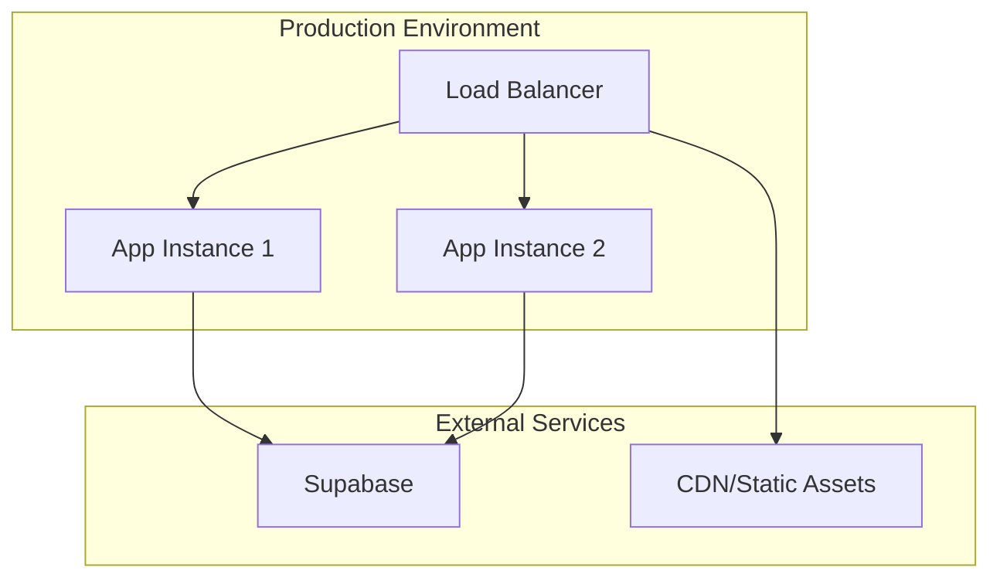

# Deployment & Operations

This document provides comprehensive guidance for deploying and operating the Chinese Flashcards application in different environments.

## Table of Contents
1. [Deployment Overview](#deployment-overview)
2. [Docker Deployment](#docker-deployment)
3. [Environment Configuration](#environment-configuration)
4. [Production Deployment](#production-deployment)
5. [Monitoring and Logging](#monitoring-and-logging)
6. [Backup and Recovery](#backup-and-recovery)
7. [Performance Optimization](#performance-optimization)
8. [Troubleshooting Guide](#troubleshooting-guide)

## Deployment Overview

The flashcards application is designed for containerized deployment using Docker and Docker Compose. The application supports multiple deployment environments with flexible configuration management through environment variables.

### Deployment Architecture


### Supported Deployment Methods
- **Docker Compose**: Local development and small-scale production
- **Kubernetes**: Scalable production deployments
- **Cloud Platforms**: AWS ECS, Google Cloud Run, Azure Container Instances
- **Traditional VPS**: Direct installation with systemd services

## Docker Deployment

### Dockerfile Configuration
```dockerfile
FROM python:3.13-slim

WORKDIR /app

# Install system dependencies
RUN apt-get update && apt-get install -y \
    gcc \
    && rm -rf /var/lib/apt/lists/*

# Install Python dependencies
COPY requirements.txt .
RUN pip install --no-cache-dir -r requirements.txt

# Copy application code
COPY . .

# Create non-root user
RUN useradd -m -u 1000 appuser && chown -R appuser:appuser /app
USER appuser

# Expose port
EXPOSE 8000

# Health check
HEALTHCHECK --interval=30s --timeout=10s --start-period=5s --retries=3 \
    CMD curl -f http://localhost:8000/health || exit 1

# Start application
CMD ["python", "main.py"]
```

### Docker Compose Configuration
```yaml
version: '3.8'

services:
  flashcards:
    build: .
    ports:
      - "8000:8000"
    environment:
      - SUPABASE_URL=${SUPABASE_URL}
      - SUPABASE_SERVICE_KEY=${SUPABASE_SERVICE_KEY}
      - SUPABASE_ANON_KEY=${SUPABASE_ANON_KEY}
      - SECRET_KEY=${SECRET_KEY}
      - ENVIRONMENT=production
    env_file:
      - .env
    restart: unless-stopped
    volumes:
      - ./logs:/app/logs
    healthcheck:
      test: ["CMD", "curl", "-f", "http://localhost:8000/health"]
      interval: 30s
      timeout: 10s
      retries: 3
      start_period: 40s

  nginx:
    image: nginx:alpine
    ports:
      - "80:80"
      - "443:443"
    volumes:
      - ./nginx.conf:/etc/nginx/nginx.conf
      - ./ssl:/etc/nginx/ssl
    depends_on:
      - flashcards
    restart: unless-stopped
```

### Build and Deployment Commands
```bash
# Build the Docker image
docker build -t flashcards-app .

# Run with Docker Compose
docker-compose up -d

# View logs
docker-compose logs -f flashcards

# Scale the application
docker-compose up -d --scale flashcards=3

# Update deployment
docker-compose pull
docker-compose up -d --no-deps flashcards
```

## Environment Configuration

### Environment Variables
```bash
# Required Configuration
SUPABASE_URL=https://your-project.supabase.co
SUPABASE_SERVICE_KEY=your-service-role-key
SUPABASE_ANON_KEY=your-anon-key
SECRET_KEY=your-256-bit-secret-key

# Optional Configuration
ENVIRONMENT=production
DEBUG=false
ALLOWED_ORIGINS=https://yourdomain.com,https://app.yourdomain.com
ACCESS_TOKEN_EXPIRE_MINUTES=30

# Logging Configuration
LOG_LEVEL=INFO
LOG_FORMAT=json
```

### Environment-Specific Configurations

#### Development
```bash
ENVIRONMENT=development
DEBUG=true
ALLOWED_ORIGINS=http://localhost:3000,http://localhost:8080
ACCESS_TOKEN_EXPIRE_MINUTES=60
LOG_LEVEL=DEBUG
```

#### Staging
```bash
ENVIRONMENT=staging
DEBUG=false
ALLOWED_ORIGINS=https://staging.yourdomain.com
ACCESS_TOKEN_EXPIRE_MINUTES=30
LOG_LEVEL=INFO
```

#### Production
```bash
ENVIRONMENT=production
DEBUG=false
ALLOWED_ORIGINS=https://yourdomain.com
ACCESS_TOKEN_EXPIRE_MINUTES=15
LOG_LEVEL=WARNING
```

## Production Deployment

### Production Deployment Checklist
- [ ] Environment variables configured securely
- [ ] SSL/TLS certificates installed
- [ ] Database backup strategy implemented
- [ ] Monitoring and alerting configured
- [ ] Log aggregation setup
- [ ] Health checks configured
- [ ] Security headers configured
- [ ] Rate limiting implemented

### Nginx Configuration
```nginx
upstream flashcards_app {
    server flashcards:8000;
}

server {
    listen 80;
    server_name yourdomain.com;
    return 301 https://$host$request_uri;
}

server {
    listen 443 ssl http2;
    server_name yourdomain.com;

    ssl_certificate /etc/nginx/ssl/cert.pem;
    ssl_certificate_key /etc/nginx/ssl/key.pem;
    
    # Security headers
    add_header X-Frame-Options "SAMEORIGIN" always;
    add_header X-Content-Type-Options "nosniff" always;
    add_header X-XSS-Protection "1; mode=block" always;
    add_header Referrer-Policy "no-referrer-when-downgrade" always;
    add_header Content-Security-Policy "default-src 'self'" always;

    # Rate limiting
    limit_req_zone $binary_remote_addr zone=api:10m rate=10r/s;
    
    location / {
        proxy_pass http://flashcards_app;
        proxy_set_header Host $host;
        proxy_set_header X-Real-IP $remote_addr;
        proxy_set_header X-Forwarded-For $proxy_add_x_forwarded_for;
        proxy_set_header X-Forwarded-Proto $scheme;
        
        # Rate limiting
        limit_req zone=api burst=20 nodelay;
    }
    
    location /health {
        proxy_pass http://flashcards_app/health;
        access_log off;
    }
}
```

### Kubernetes Deployment
```yaml
apiVersion: apps/v1
kind: Deployment
metadata:
  name: flashcards-app
spec:
  replicas: 3
  selector:
    matchLabels:
      app: flashcards
  template:
    metadata:
      labels:
        app: flashcards
    spec:
      containers:
      - name: flashcards
        image: flashcards-app:latest
        ports:
        - containerPort: 8000
        env:
        - name: SUPABASE_URL
          valueFrom:
            secretKeyRef:
              name: flashcards-secrets
              key: supabase-url
        - name: SECRET_KEY
          valueFrom:
            secretKeyRef:
              name: flashcards-secrets
              key: secret-key
        resources:
          requests:
            memory: "256Mi"
            cpu: "250m"
          limits:
            memory: "512Mi"
            cpu: "500m"
        livenessProbe:
          httpGet:
            path: /health
            port: 8000
          initialDelaySeconds: 30
          periodSeconds: 10
        readinessProbe:
          httpGet:
            path: /health
            port: 8000
          initialDelaySeconds: 5
          periodSeconds: 5
```

## Monitoring and Logging

### Application Logging
```python
import logging
import json
from datetime import datetime

class JSONFormatter(logging.Formatter):
    def format(self, record):
        log_entry = {
            "timestamp": datetime.utcnow().isoformat(),
            "level": record.levelname,
            "message": record.getMessage(),
            "module": record.module,
            "function": record.funcName,
            "line": record.lineno
        }
        return json.dumps(log_entry)

# Configure logging
logging.basicConfig(
    level=getattr(logging, settings.log_level.upper()),
    format='%(asctime)s - %(name)s - %(levelname)s - %(message)s'
)
```

### Health Check Endpoint
```python
@app.get("/health")
async def health_check():
    try:
        # Check database connectivity
        supabase = get_supabase_client()
        supabase.table("users").select("count", count="exact").execute()
        
        return {
            "status": "healthy",
            "timestamp": datetime.utcnow().isoformat(),
            "version": "1.0.0",
            "database": "connected"
        }
    except Exception as e:
        raise HTTPException(
            status_code=503,
            detail={
                "status": "unhealthy",
                "error": str(e),
                "timestamp": datetime.utcnow().isoformat()
            }
        )
```

### Monitoring Metrics
```python
from prometheus_client import Counter, Histogram, Gauge

# Application metrics
REQUEST_COUNT = Counter('http_requests_total', 'Total HTTP requests', ['method', 'endpoint'])
REQUEST_DURATION = Histogram('http_request_duration_seconds', 'HTTP request duration')
ACTIVE_USERS = Gauge('active_users_total', 'Number of active users')
STUDY_SESSIONS = Counter('study_sessions_total', 'Total study sessions created')
```

## Backup and Recovery

### Database Backup Strategy
```bash
#!/bin/bash
# Automated backup script

BACKUP_DIR="/backups"
DATE=$(date +%Y%m%d_%H%M%S)
BACKUP_FILE="flashcards_backup_${DATE}.sql"

# Create backup using pg_dump
pg_dump $DATABASE_URL > "${BACKUP_DIR}/${BACKUP_FILE}"

# Compress backup
gzip "${BACKUP_DIR}/${BACKUP_FILE}"

# Upload to cloud storage (AWS S3 example)
aws s3 cp "${BACKUP_DIR}/${BACKUP_FILE}.gz" s3://your-backup-bucket/

# Clean up old backups (keep last 30 days)
find $BACKUP_DIR -name "*.gz" -mtime +30 -delete
```

### Backup Verification
```bash
#!/bin/bash
# Verify backup integrity

BACKUP_FILE=$1
TEST_DB="flashcards_test_restore"

# Create test database
createdb $TEST_DB

# Restore backup
gunzip -c $BACKUP_FILE | psql $TEST_DB

# Run basic queries to verify data integrity
psql $TEST_DB -c "SELECT COUNT(*) FROM users;"
psql $TEST_DB -c "SELECT COUNT(*) FROM decks;"
psql $TEST_DB -c "SELECT COUNT(*) FROM cards;"

# Clean up test database
dropdb $TEST_DB
```

## Performance Optimization

### Database Optimization
```sql
-- Create indexes for frequently queried columns
CREATE INDEX idx_user_card_progress_user_id ON user_card_progress(user_id);
CREATE INDEX idx_user_card_progress_card_id ON user_card_progress(card_id);
CREATE INDEX idx_cards_deck_id ON cards(deck_id);
CREATE INDEX idx_study_sessions_user_id ON study_sessions(user_id);
CREATE INDEX idx_card_interactions_session_id ON card_interactions(session_id);

-- Analyze query performance
EXPLAIN ANALYZE SELECT * FROM user_card_progress WHERE user_id = $1;
```

### Application Performance
```python
# Connection pooling configuration
engine = create_async_engine(
    database_url,
    pool_size=20,
    max_overflow=30,
    pool_pre_ping=True,
    pool_recycle=3600
)

# Caching configuration
from functools import lru_cache

@lru_cache(maxsize=1000)
def get_user_statistics(user_id: str):
    # Cached user statistics
    pass
```

### CDN Configuration
```nginx
# Static asset caching
location /static/ {
    alias /app/static/;
    expires 1y;
    add_header Cache-Control "public, immutable";
}

location ~* \.(js|css|png|jpg|jpeg|gif|ico|svg)$ {
    expires 1y;
    add_header Cache-Control "public, immutable";
}
```

## Troubleshooting Guide

### Common Issues and Solutions

#### Database Connection Problems
**Symptoms**: Connection timeouts or authentication failures

**Diagnosis**:
```bash
# Test Supabase connection
curl -H "apikey: YOUR_ANON_KEY" \
     -H "Authorization: Bearer YOUR_SERVICE_KEY" \
     "https://your-project.supabase.co/rest/v1/users?select=count"
```

**Solutions**:
- Verify Supabase URL and keys
- Check network connectivity
- Ensure service key has correct permissions
- Review connection pool settings

#### High Memory Usage
**Symptoms**: Application crashes or slow performance

**Diagnosis**:
```bash
# Monitor memory usage
docker stats flashcards-app

# Check for memory leaks
docker exec flashcards-app python -c "
import psutil
process = psutil.Process()
print(f'Memory: {process.memory_info().rss / 1024 / 1024:.2f} MB')
"
```

**Solutions**:
- Increase container memory limits
- Implement proper connection pooling
- Add caching to reduce database queries
- Review for memory leaks in async operations

#### Authentication Issues
**Symptoms**: 401 errors or token validation failures

**Diagnosis**:
```bash
# Test JWT token generation
python -c "
from app.auth.auth_service import AuthService
from app.core.config import get_settings
service = AuthService()
token = service.create_access_token({'sub': 'test_user'})
print(token)
"
```

**Solutions**:
- Verify SECRET_KEY consistency
- Check token expiration settings
- Review CORS configuration
- Validate Supabase Auth configuration

#### Performance Issues
**Symptoms**: Slow response times

**Diagnosis**:
```bash
# Profile API endpoints
curl -w "@curl-format.txt" -o /dev/null -s "http://localhost:8000/api/users/me"

# Check database query performance
docker exec postgres psql -U postgres -d flashcards -c "
SELECT query, mean_time, calls 
FROM pg_stat_statements 
ORDER BY mean_time DESC LIMIT 10;
"
```

**Solutions**:
- Add database indexes for slow queries
- Implement query result caching
- Optimize database connection pooling
- Review async operation patterns

**Referenced Files:**
- [Dockerfile](../Dockerfile)
- [docker-compose.yml](../docker-compose.yml)
- [app/core/config.py](../app/core/config.py)
- [app/main.py](../app/main.py)