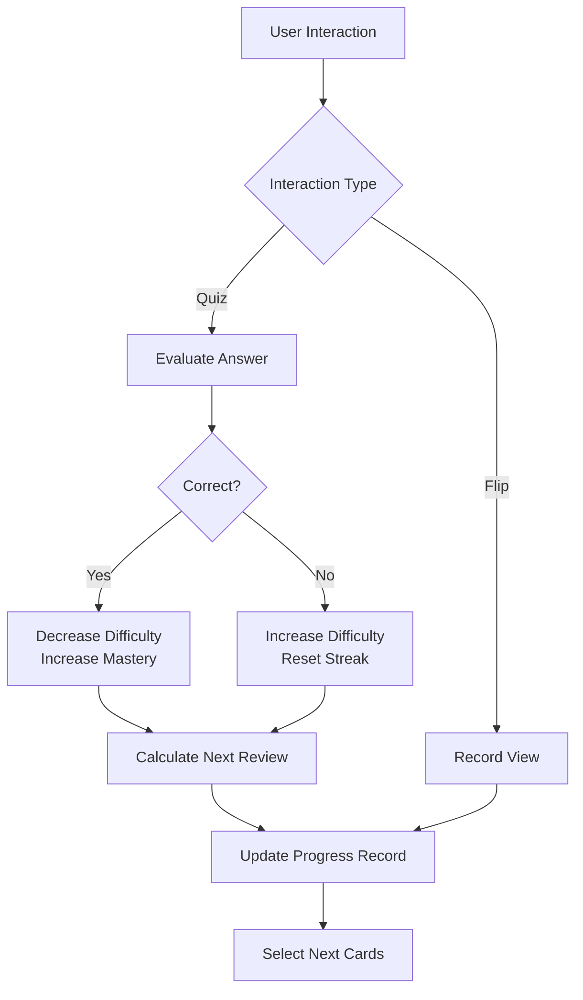
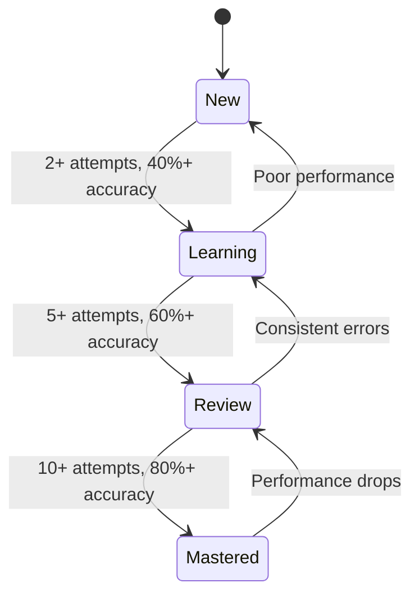
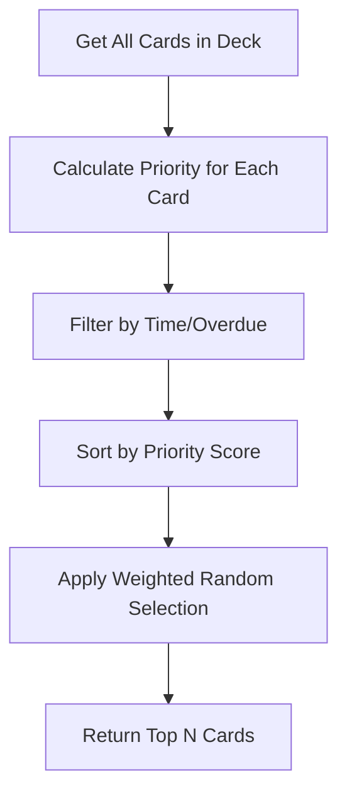
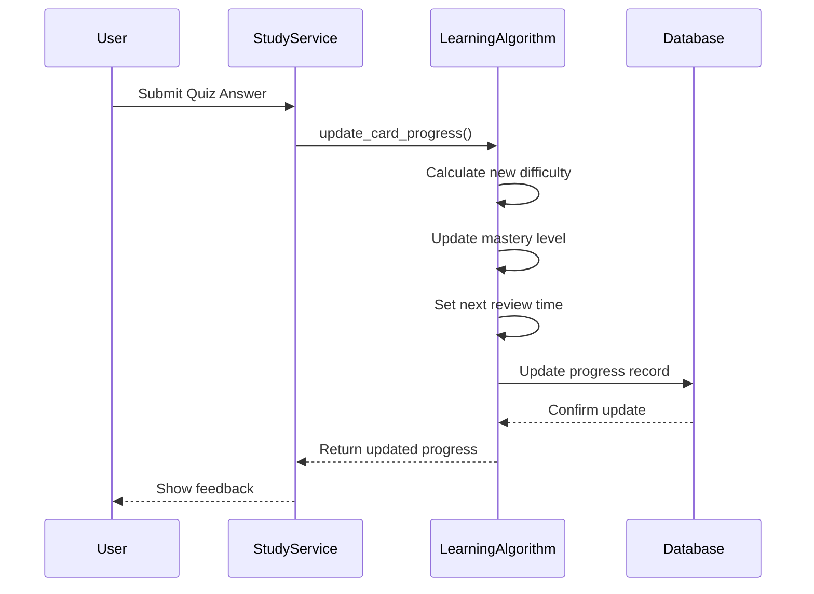

# Learning Algorithm

This document provides comprehensive documentation for the adaptive learning algorithm that drives the educational experience in the Chinese Flashcards application.

## Table of Contents
1. [Algorithm Overview](#algorithm-overview)
2. [Mastery Level System](#mastery-level-system)
3. [Difficulty Score Calculation](#difficulty-score-calculation)
4. [Card Selection Heuristics](#card-selection-heuristics)
5. [Spaced Repetition Implementation](#spaced-repetition-implementation)
6. [Progress Update Logic](#progress-update-logic)
7. [Configuration Parameters](#configuration-parameters)
8. [Performance and Optimization](#performance-and-optimization)

## Algorithm Overview

The adaptive learning algorithm is designed to optimize the learning experience by personalizing card presentation based on individual user performance. It implements spaced repetition principles combined with difficulty adjustment to ensure effective long-term retention.

### Core Components
```python
class LearningAlgorithm:
    def update_card_progress(self, user_id: uuid.UUID, card_id: uuid.UUID, 
                           interaction_type: str, is_correct: bool, response_time: int) -> UserCardProgressResponse
    def select_cards_for_study(self, user_id: uuid.UUID, deck_id: uuid.UUID, 
                             target_count: int, include_overdue: bool) -> List[uuid.UUID]
    def get_study_statistics(self, user_id: uuid.UUID, deck_id: uuid.UUID) -> Dict
```

### Algorithm Flow


## Mastery Level System

The algorithm tracks four distinct mastery levels that represent the user's proficiency with each card:

### Level Definitions
- **0 (New)**: Card has been introduced but not sufficiently practiced
- **1 (Learning)**: User has demonstrated basic understanding but needs reinforcement
- **2 (Review)**: User shows consistent performance; card enters periodic review
- **3 (Mastered)**: User has demonstrated long-term retention; minimal review needed

### Level Calculation Logic
```python
def _calculate_mastery_level(self, quiz_attempts: int, quiz_correct: int, current_level: int) -> int:
    if quiz_attempts == 0:
        return 0  # New
    accuracy = quiz_correct / quiz_attempts
    
    if quiz_attempts >= 10 and accuracy >= 0.8:
        return 3  # Mastered
    elif quiz_attempts >= 5 and accuracy >= 0.6:
        return 2  # Review
    elif quiz_attempts >= 2 and accuracy >= 0.4:
        return 1  # Learning
    else:
        return 0  # New/struggling
```

### Mastery Level Transitions


## Difficulty Score Calculation

The difficulty score represents how challenging a card is for the user, ranging from 0.1 (very easy) to 5.0 (very difficult). This score is dynamically adjusted based on user performance.

### Adjustment Rules
- **Correct Answer**: `difficulty_score *= 0.85` (make easier)
- **Incorrect Answer**: `difficulty_score *= 1.4` (make harder)
- **Bounds**: Always clamped between 0.1 and 5.0

### Response Time Influence
```python
def _adjust_for_response_time(self, base_difficulty: float, response_time: int) -> float:
    """Adjust difficulty based on response time"""
    if response_time > 10000:  # > 10 seconds
        return min(base_difficulty * 1.2, 5.0)
    elif response_time < 2000:  # < 2 seconds
        return max(base_difficulty * 0.9, 0.1)
    return base_difficulty
```

## Card Selection Heuristics

The algorithm selects cards for study sessions using a weighted priority system that considers multiple factors.

### Priority Calculation
```python
def _calculate_card_priority(self, progress: UserCardProgress, current_time: datetime, include_overdue: bool) -> float:
    base_weight = self._get_base_weight(progress.mastery_level)
    
    # Time-based multipliers
    time_multiplier = 1.0
    if progress.next_review_at and progress.next_review_at <= current_time:
        time_multiplier = self.config.overdue_weight
    
    # Difficulty multiplier
    difficulty_multiplier = progress.difficulty_score / 2.5
    
    return base_weight * time_multiplier * difficulty_multiplier
```

### Selection Weights
| Mastery Level | Base Weight | Description |
|---------------|-------------|-------------|
| New (0) | 2.0 | Highest priority for new cards |
| Learning (1) | 1.2 | High priority for cards being learned |
| Review (2) | 1.0 | Standard priority for review cards |
| Mastered (3) | 0.3 | Low priority for mastered cards |

### Weighted Selection Algorithm


## Spaced Repetition Implementation

The algorithm implements spaced repetition by calculating optimal review intervals based on mastery level and recent performance.

### Interval Calculation
```python
def _calculate_next_review_time(self, mastery_level: int, difficulty_score: float, is_correct: bool) -> datetime:
    base_intervals = {
        0: 1,      # New: 1 day
        1: 3,      # Learning: 3 days
        2: 7,      # Review: 1 week
        3: 30      # Mastered: 1 month
    }
    
    base_days = base_intervals[mastery_level]
    
    # Adjust based on difficulty and performance
    if is_correct:
        multiplier = 2.0 / difficulty_score  # Easier cards wait longer
    else:
        multiplier = 0.5  # Failed cards come back sooner
    
    interval_days = base_days * multiplier
    return datetime.utcnow() + timedelta(days=interval_days)
```

### Interval Progression

```mermaid
gantt
    title Card Review Intervals
    dateFormat X
    axisFormat %d
    
    section New Card
    First Review     :1, 1
    Second Review    :3, 3
    
    section Learning
    Review 1         :3, 3
    Review 2         :7, 7
    
    section Review
    Review 1         :7, 7
    Review 2         :14, 14
    
    section Mastered
    Review 1         :30, 30
    Review 2         :60, 60
```


## Progress Update Logic

The algorithm updates user progress after each interaction, maintaining detailed statistics for personalized learning.

### Update Flow


### Progress Fields Updated
- **Quiz Statistics**: `quiz_attempts`, `quiz_correct`, `consecutive_correct`
- **Difficulty**: `difficulty_score` adjusted based on performance
- **Mastery**: `mastery_level` updated according to performance thresholds
- **Timing**: `next_review_at` calculated using spaced repetition
- **Metadata**: `last_quiz_attempt_at`, `updated_at`

## Configuration Parameters

### Selection Weights
| Parameter | Default Value | Description |
|---------|-------------|-------------|
| new_card_weight | 2.0 | Base priority weight for new cards |
| overdue_weight | 1.5 | Multiplier for overdue cards |
| learning_weight | 1.2 | Base priority weight for learning cards |
| review_weight | 1.0 | Base priority weight for review cards |
| mastered_weight | 0.3 | Base priority weight for mastered cards |

### Difficulty Adjustment
| Parameter | Default Value | Description |
|---------|-------------|-------------|
| correct_multiplier | 0.85 | Difficulty reduction for correct answers |
| incorrect_multiplier | 1.4 | Difficulty increase for incorrect answers |
| min_difficulty | 0.1 | Minimum difficulty score |
| max_difficulty | 5.0 | Maximum difficulty score |

### Review Intervals
| Parameter | Default Value | Description |
|---------|-------------|-------------|
| new_interval_days | 1 | Initial review interval for new cards |
| learning_interval_days | 3 | Base interval for learning cards |
| review_interval_days | 7 | Base interval for review cards |
| mastered_interval_days | 30 | Base interval for mastered cards |

## Performance and Optimization

### Database Optimization
- **Indexing**: The `user_card_progress` table should have indexes on `user_id` and `card_id` columns
- **Batch Operations**: Progress updates are single-record operations to minimize database load
- **Caching**: Frequently accessed statistics could be cached to reduce database queries

### Algorithmic Efficiency
- **Time Complexity**: O(n log n) for card selection, where n is the number of cards in the deck
- **Space Complexity**: O(n) for storing card priorities during selection
- **Early Termination**: The algorithm returns immediately if no cards are found in the deck

### Memory Management
- **Progress Caching**: Cache user progress for active study sessions
- **Lazy Loading**: Load card data only when needed for calculations
- **Cleanup**: Regular cleanup of expired session data

**Referenced Files:**
- [app/services/learning_service.py](../app/services/learning_service.py)
- [app/models/database.py](../app/models/database.py)
- [app/services/study_service.py](../app/services/study_service.py)