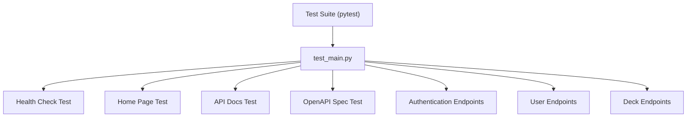
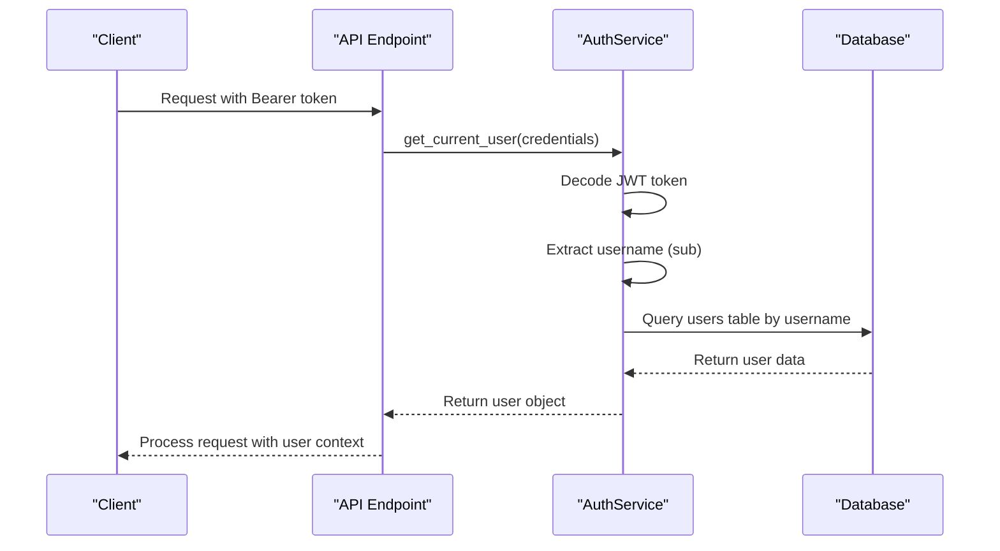
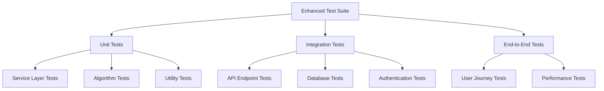
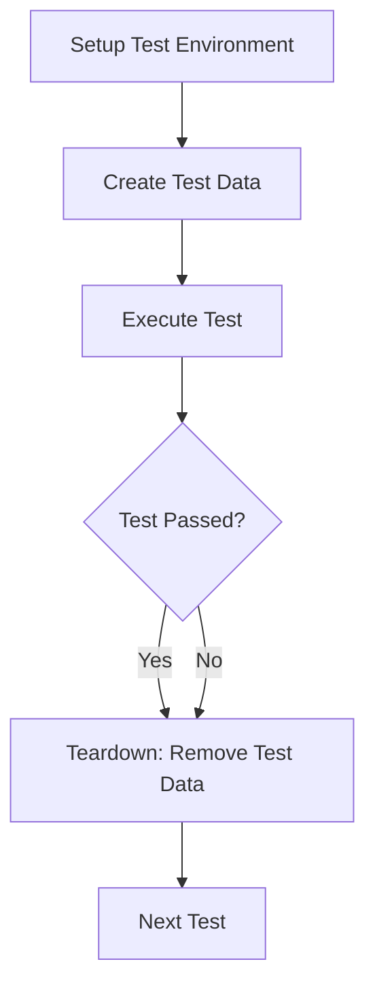

# Testing Strategy

This document outlines the testing approach, current test structure, and best practices for testing the Chinese Flashcards application.

## Table of Contents
1. [Current Test Structure](#current-test-structure)
2. [Testing Framework and Tools](#testing-framework-and-tools)
3. [Best Practices for FastAPI Testing](#best-practices-for-fastapi-testing)
4. [Testing Authentication Flows](#testing-authentication-flows)
5. [Database Testing Strategies](#database-testing-strategies)
6. [API Endpoint Testing](#api-endpoint-testing)
7. [Service Layer Testing](#service-layer-testing)
8. [Recommended Testing Improvements](#recommended-testing-improvements)

## Current Test Structure

The flashcards application currently implements a minimal testing suite using **pytest** with a single integration test file located at `tests/test_main.py`. This structure reflects an early stage of test coverage, focusing primarily on high-level application behavior and API endpoint availability.



The existing test suite verifies basic application functionality such as:
- Health checks and application startup
- Home page rendering and API documentation accessibility
- Preliminary tests for authentication and user management endpoints
- Basic endpoint existence validation (rather than full functionality due to lack of test database)

## Testing Framework and Tools

### Primary Testing Stack
- **pytest**: Main testing framework with powerful fixtures and parametrization
- **httpx**: Async HTTP client for testing FastAPI applications
- **pytest-asyncio**: Support for async test functions
- **FastAPI TestClient**: Built-in testing utilities for FastAPI applications

### Testing Dependencies
```python
# Example test dependencies
import pytest
from fastapi.testclient import TestClient
from httpx import AsyncClient
from app.main import app

client = TestClient(app)
```

### Test Configuration
```python
# pytest configuration in pytest.ini or pyproject.toml
[tool.pytest.ini_options]
testpaths = ["tests"]
python_files = ["test_*.py"]
python_classes = ["Test*"]
python_functions = ["test_*"]
asyncio_mode = "auto"
```

## Best Practices for FastAPI Testing

### Database Mocking
Recommended approaches include:
- Using **unittest.mock** or **pytest-mock** to patch database calls
- Implementing in-memory SQLite databases for integration tests
- Creating mock Supabase client objects that simulate API responses

```python
# Example of database mocking
from unittest.mock import MagicMock

@pytest.fixture
def mock_supabase():
    mock_client = MagicMock()
    mock_client.table.return_value.select.return_value.execute.return_value.data = []
    return mock_client
```

### Dependency Overriding
FastAPI's dependency injection system supports **dependency overriding** for testing purposes:

```python
# Example of dependency override
def override_get_supabase_client():
    return mock_supabase_client

app.dependency_overrides[get_supabase_client] = override_get_supabase_client
```

This technique enables isolated testing of API routes without requiring actual database connectivity or authentication services.

### Test Client Setup
```python
@pytest.fixture
def client():
    with TestClient(app) as test_client:
        yield test_client

@pytest.fixture
async def async_client():
    async with AsyncClient(app=app, base_url="http://test") as ac:
        yield ac
```

## Testing Authentication Flows

### Authentication Endpoint Testing
Comprehensive tests should cover:
- Successful registration with valid credentials
- Validation of duplicate usernames/emails
- Password strength requirements
- JWT token generation upon login

```python
def test_user_registration(client):
    response = client.post("/api/auth/register", json={
        "username": "testuser",
        "email": "test@example.com",
        "password": "securepassword123"
    })
    assert response.status_code == 201
    assert "id" in response.json()
```

### Token Validation and User Retrieval


### Authentication Test Examples
```python
def test_login_success(client, mock_user):
    response = client.post("/api/auth/login", json={
        "username": "testuser",
        "password": "correctpassword"
    })
    assert response.status_code == 200
    assert "access_token" in response.json()

def test_protected_route_with_token(client, auth_headers):
    response = client.get("/api/users/me", headers=auth_headers)
    assert response.status_code == 200

def test_protected_route_without_token(client):
    response = client.get("/api/users/me")
    assert response.status_code == 401
```

## Database Testing Strategies

### Test Database Setup
```python
@pytest.fixture(scope="session")
def test_db():
    # Create test database
    engine = create_engine("sqlite:///./test.db")
    Base.metadata.create_all(bind=engine)
    yield engine
    # Cleanup
    Base.metadata.drop_all(bind=engine)
    os.unlink("./test.db")
```

### Transaction Rollback Pattern
```python
@pytest.fixture
def db_session(test_db):
    connection = test_db.connect()
    transaction = connection.begin()
    session = Session(bind=connection)
    
    yield session
    
    transaction.rollback()
    connection.close()
```

### Mocking Supabase Operations
```python
@pytest.fixture
def mock_supabase_auth():
    mock_auth = MagicMock()
    mock_auth.sign_up.return_value.user = {"id": "test-user-id"}
    mock_auth.sign_in_with_password.return_value.user = {"id": "test-user-id"}
    return mock_auth
```

## API Endpoint Testing

### Deck Management Tests
```python
class TestDeckEndpoints:
    def test_create_deck(self, client, auth_headers):
        response = client.post("/api/decks/", 
            json={"name": "Test Deck", "description": "A test deck"},
            headers=auth_headers
        )
        assert response.status_code == 201
        assert response.json()["name"] == "Test Deck"
    
    def test_get_user_decks(self, client, auth_headers):
        response = client.get("/api/decks/", headers=auth_headers)
        assert response.status_code == 200
        assert isinstance(response.json(), list)
    
    def test_deck_ownership_validation(self, client, auth_headers, other_user_deck):
        response = client.get(f"/api/decks/{other_user_deck.id}", headers=auth_headers)
        assert response.status_code == 404  # Should not access other user's deck
```

### Card Management Tests
```python
class TestCardEndpoints:
    def test_create_card(self, client, auth_headers, user_deck):
        response = client.post(f"/api/decks/{user_deck.id}/cards/",
            json={
                "hanzi": "你好",
                "pinyin": "nǐ hǎo",
                "english": "hello"
            },
            headers=auth_headers
        )
        assert response.status_code == 201
        assert response.json()["hanzi"] == "你好"
```

### CSV Import/Export Tests
```python
class TestCSVEndpoints:
    def test_csv_import(self, client, auth_headers, user_deck):
        csv_content = "hanzi,pinyin,english\n你好,nǐ hǎo,hello\n再见,zàijiàn,goodbye"
        files = {"file": ("test.csv", csv_content, "text/csv")}
        
        response = client.post(f"/api/csv/import/{user_deck.id}",
            files=files,
            headers=auth_headers
        )
        assert response.status_code == 200
        assert response.json()["imported_count"] == 2
```

## Service Layer Testing

### Unit Tests for Business Logic
```python
class TestDeckService:
    @pytest.fixture
    def deck_service(self, mock_supabase):
        return DeckService(mock_supabase)
    
    async def test_create_deck(self, deck_service, mock_user):
        deck_data = DeckCreate(name="Test Deck", description="Test")
        result = await deck_service.create_deck(mock_user.id, deck_data)
        
        assert result is not None
        assert result.name == "Test Deck"
```

### Learning Algorithm Tests
```python
class TestLearningAlgorithm:
    def test_difficulty_calculation(self, learning_algorithm):
        # Test difficulty increases on incorrect answers
        new_difficulty = learning_algorithm._calculate_difficulty_score(
            current_score=1.0, is_correct=False, consecutive_correct=0
        )
        assert new_difficulty > 1.0
    
    def test_mastery_level_progression(self, learning_algorithm):
        # Test mastery level calculation
        level = learning_algorithm._calculate_mastery_level(
            quiz_attempts=10, quiz_correct=9, current_level=1
        )
        assert level >= 2  # Should advance to Review or Mastered
```

## Recommended Testing Improvements

### Test Structure Enhancement


### Testing Lifecycle


### Coverage Goals
- **Unit Tests**: 90%+ coverage for business logic and utilities
- **Integration Tests**: All API endpoints with authentication scenarios
- **End-to-End Tests**: Critical user journeys (registration, study sessions)
- **Performance Tests**: Load testing for concurrent users

### Test Data Management
```python
@pytest.fixture
def sample_cards():
    return [
        {"hanzi": "你好", "pinyin": "nǐ hǎo", "english": "hello"},
        {"hanzi": "再见", "pinyin": "zàijiàn", "english": "goodbye"},
        {"hanzi": "谢谢", "pinyin": "xièxie", "thank you"}
    ]

@pytest.fixture
def mock_user_progress():
    return {
        "quiz_attempts": 5,
        "quiz_correct": 4,
        "difficulty_score": 1.2,
        "mastery_level": 1
    }
```

### Continuous Integration
```yaml
# Example GitHub Actions workflow
name: Test Suite
on: [push, pull_request]
jobs:
  test:
    runs-on: ubuntu-latest
    steps:
      - uses: actions/checkout@v2
      - name: Set up Python
        uses: actions/setup-python@v2
        with:
          python-version: 3.13
      - name: Install dependencies
        run: pip install -r requirements.txt
      - name: Run tests
        run: pytest --cov=app tests/
      - name: Upload coverage
        uses: codecov/codecov-action@v1
```

**Referenced Files:**
- [tests/test_main.py](../tests/test_main.py)
- [app/auth/auth_service.py](../app/auth/auth_service.py)
- [app/auth/dependencies.py](../app/auth/dependencies.py)