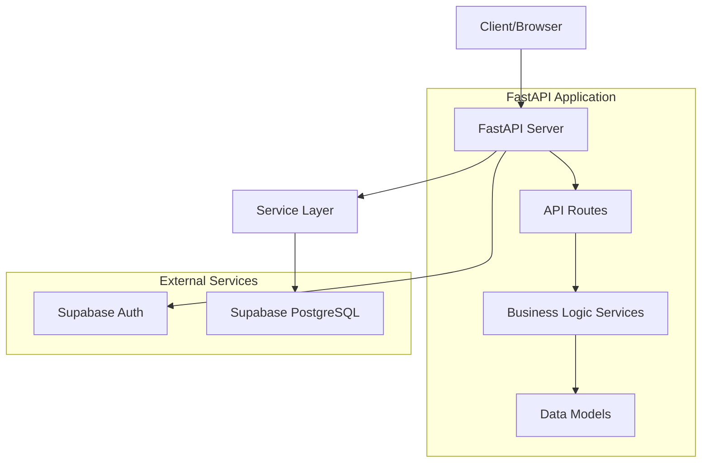
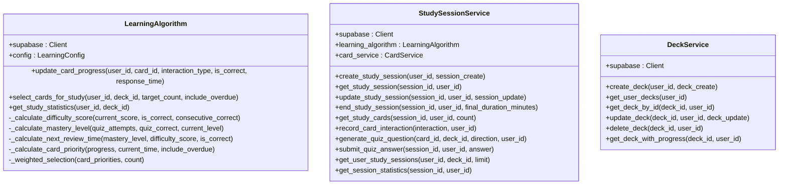

# Project Overview

This document provides a comprehensive overview of the Chinese Flashcards application, a modern web application built with Python and FastAPI for learning Chinese vocabulary through interactive flashcards.

## Table of Contents
1. [Architecture Overview](#architecture-overview)
2. [Core Components](#core-components)
3. [API Routes](#api-routes)
4. [Services](#services)
5. [Deployment and Configuration](#deployment-and-configuration)
6. [Security Practices](#security-practices)

## Architecture Overview

The flashcards application is built using a modern, layered architecture that separates concerns and promotes maintainability. The application uses FastAPI as the web framework, Supabase for authentication and database management, and follows service-oriented design patterns.



The system operates as follows:
1. The client (web browser) sends HTTP requests to the FastAPI server
2. The FastAPI server handles authentication through Supabase Auth
3. Authenticated requests are processed by the appropriate API routes
4. Business logic is executed through service layer components
5. Data operations are performed on the Supabase PostgreSQL database
6. Responses are returned to the client in JSON format

This architecture leverages Supabase's real-time capabilities and robust security features while maintaining a clean separation between the application logic and data storage.

## Core Components

### API Routes
The API routes serve as the entry points for all client interactions with the application. Each route file corresponds to a specific domain of functionality, following RESTful principles.

```mermaid
graph TD
A[API Routes] --> B[Authentication]
A --> C[Users]
A --> D[Decks]
A --> E[Cards]
A --> F[Study]
A --> G[CSV]
A --> H[Statistics]
B --> I[/api/auth/register]
B --> J[/api/auth/login]
B --> K[/api/auth/me]
C --> L[/api/users/]
C --> M[/api/users/me]
D --> N[/api/decks/]
D --> O[/api/decks/{id}]
E --> P[/api/decks/{deck_id}/cards/]
E --> Q[/api/cards/{id}]
F --> R[/api/study/session]
F --> S[/api/study/cards]
F --> T[/api/study/quiz]
G --> U[/api/csv/import]
G --> V[/api/csv/export]
H --> W[/api/statistics/user]
H --> X[/api/statistics/deck]
```

The routes are organized by functionality, with each file handling a specific domain:
- **Authentication routes**: Handle user registration, login, and profile management
- **User routes**: Manage user-related operations and statistics
- **Deck routes**: Handle CRUD operations for flashcard decks
- **Card routes**: Manage individual flashcards within decks
- **Study routes**: Facilitate study sessions and learning interactions
- **CSV routes**: Enable bulk import and export of flashcard data
- **Statistics routes**: Provide learning analytics and progress tracking

## Services

The service layer contains the business logic for the application, implementing the core functionality that drives the learning experience. Each service corresponds to a specific domain and encapsulates related operations.



## Deployment and Configuration

The application uses environment-based configuration managed through the core/config.py module. Key configuration settings include:

**Supabase Integration**
- `SUPABASE_URL`: The URL of the Supabase project
- `SUPABASE_SERVICE_KEY`: Service role key for administrative database operations
- `SUPABASE_ANON_KEY`: Anonymous key for client-side operations

**Security Settings**
- `SECRET_KEY`: Secret key for JWT token signing
- `ALGORITHM`: JWT signing algorithm (typically HS256)
- `ACCESS_TOKEN_EXPIRE_MINUTES`: Token expiration time in minutes

**Application Settings**
- `ENVIRONMENT`: Current environment (development, production)
- `ALLOWED_ORIGINS`: CORS origins that are permitted to access the API

### Docker Deployment
The application includes a Dockerfile and docker-compose.yml for containerized deployment:

```dockerfile
# Dockerfile
FROM python:3.10-slim

WORKDIR /app

COPY requirements.txt .
RUN pip install -r requirements.txt

COPY . .

CMD ["python", "main.py"]
```

The docker-compose.yml file orchestrates the application and its dependencies:

```yaml
version: '3.8'
services:
  flashcards:
    build: .
    ports:
      - "8000:8000"
    env_file:
      - .env
    restart: unless-stopped
```

This setup allows for easy deployment with consistent environment configuration.

## Security Practices

The application implements several security practices to protect user data and ensure the integrity of the learning platform. These practices leverage Supabase's built-in security features while adding additional application-level protections.

### Authentication and Authorization
The application uses Supabase Auth for user authentication, which provides:
- Secure JWT-based authentication
- Password hashing and storage
- Session management
- OAuth integration capabilities

Role-based access control ensures that users can only access their own data:
- Users can only view and modify their own decks and cards
- Users cannot access other users' study progress or statistics
- Administrative operations are restricted to authorized roles

### Data Protection
The application implements several data protection measures:
- All sensitive data is transmitted over HTTPS in production
- Passwords are never stored in the application database (handled by Supabase Auth)
- JWT tokens are used for session management with appropriate expiration times
- Environment variables containing sensitive information are not committed to version control

**Referenced Files:**
- [app/main.py](../app/main.py)
- [app/core/config.py](../app/core/config.py)
- [Dockerfile](../Dockerfile)
- [docker-compose.yml](../docker-compose.yml)
- [app/api/routes/](../app/api/routes/)
- [app/services/](../app/services/)