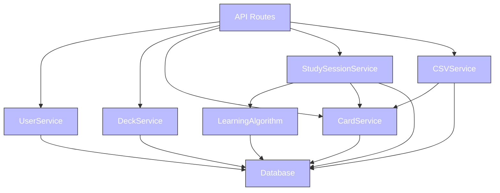
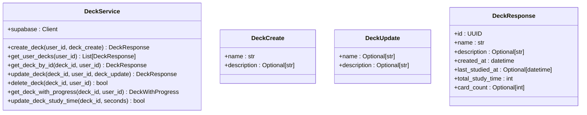
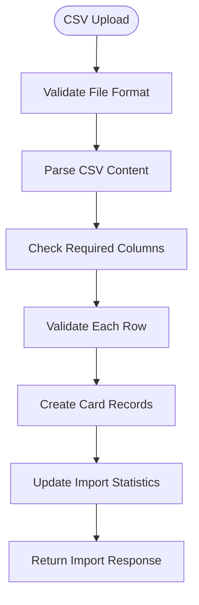
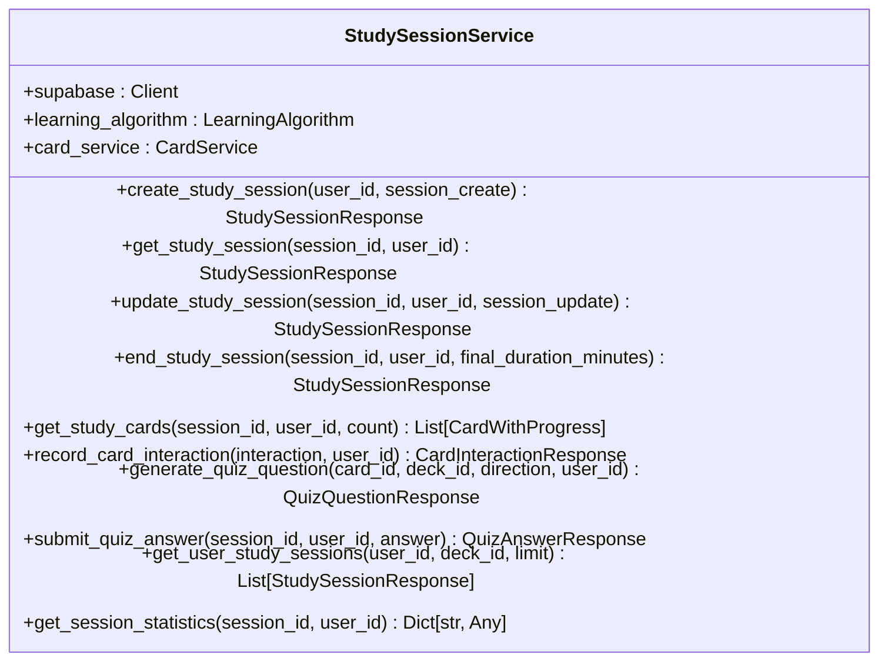
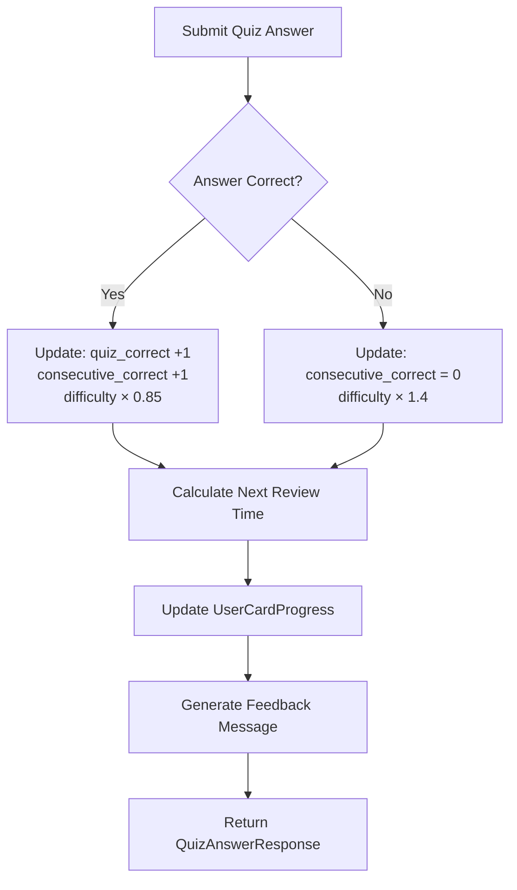
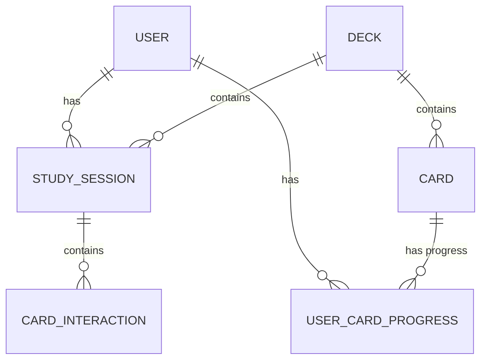
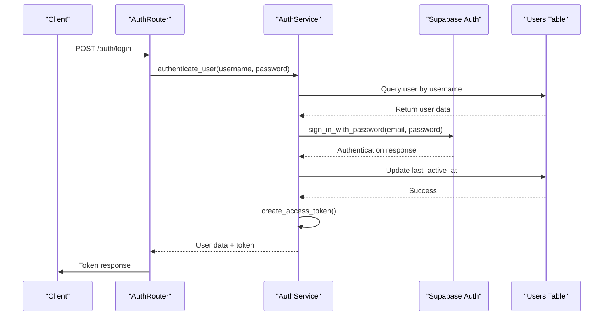

# Business Logic Layer

This document provides comprehensive documentation for the service layer architecture and business logic implementation in the Chinese Flashcards application.

## Table of Contents
1. [Introduction](#introduction)
2. [Service-Oriented Architecture](#service-oriented-architecture)
3. [User Service](#user-service)
4. [Deck Service](#deck-service)
5. [Card Service](#card-service)
6. [CSV Service](#csv-service)
7. [Learning Service](#learning-service)
8. [Study Service](#study-service)
9. [Statistics Service](#statistics-service)
10. [Authentication Service](#authentication-service)
11. [Service Composition Patterns](#service-composition-patterns)
12. [Transaction Management and Error Handling](#transaction-management-and-error-handling)

## Introduction

The business logic layer serves as the core of the flashcard application, implementing domain-specific operations and coordinating between the API layer and data persistence. This layer ensures that business rules are enforced, data integrity is maintained, and complex workflows are properly orchestrated.

## Service-Oriented Architecture

The application employs a service-oriented design pattern where each service class is responsible for a specific domain area. Services act as intermediaries between the API controllers and the database, encapsulating business logic, validation rules, and transaction management.



Each service is instantiated with a Supabase client, enabling direct database operations while maintaining separation from the presentation layer. Services are designed to be stateless and reusable, allowing them to be composed together for complex workflows.

## User Service

The UserService handles user-related operations including profile management and user statistics.

### Core Operations
- **User Profile Management**: Retrieve and update user profile information
- **Statistics Aggregation**: Calculate user-wide learning metrics
- **Account Operations**: Support for account-related business logic

### Key Methods
```python
class UserService:
    def __init__(self, supabase: Client):
        self.supabase = supabase
    
    async def get_user_profile(self, user_id: uuid.UUID) -> Optional[UserResponse]
    async def update_user_profile(self, user_id: uuid.UUID, user_update: UserUpdate) -> Optional[UserResponse]
    async def get_user_statistics(self, user_id: uuid.UUID) -> Optional[UserStatisticsResponse]
```

### Integration Points
- **Authentication Service**: Works with auth for user verification
- **Statistics Service**: Aggregates learning data across all user activities
- **Deck Service**: Retrieves user's deck collections

## Deck Service

The DeckService encapsulates all business logic for deck operations, ensuring separation from API routing concerns.



### Business Rules
- **Ownership Validation**: Ensures users can only access their own decks
- **Card Count Integration**: Automatically calculates card counts for deck responses
- **Study Time Tracking**: Updates total study time when sessions end
- **Cascade Deletion**: Handles cleanup of related cards and progress when decks are deleted

## Card Service

The CardService provides comprehensive flashcard management functionality with proper validation and integration with other services.

### Core CRUD Operations
The service implements standard CRUD operations for managing flashcards within decks:

```python
class CardService:
    async def create_card(self, deck_id: uuid.UUID, card_create: CardCreate) -> Optional[CardResponse]
    async def get_deck_cards(self, deck_id: uuid.UUID, pagination: dict, search: str) -> List[CardResponse]
    async def get_card_by_id(self, card_id: uuid.UUID) -> Optional[CardResponse]
    async def get_card_with_progress(self, card_id: uuid.UUID, user_id: uuid.UUID) -> Optional[CardWithProgress]
    async def update_card(self, card_id: uuid.UUID, card_update: CardUpdate) -> Optional[CardResponse]
    async def delete_card(self, card_id: uuid.UUID) -> bool
```

### Advanced Features
- **Search Functionality**: Text search across hanzi, pinyin, and english fields
- **Pagination Support**: Efficient loading of large card sets
- **Progress Integration**: Combines card data with user-specific progress metrics
- **Bulk Operations**: Support for batch card creation via CSV import

## CSV Service

The CSVService handles bulk import and export operations for flashcard data.

### Import Process
The import process includes comprehensive validation and error handling:



### Export Functionality
Export operations support multiple formats and optional statistics inclusion:
- **Basic Export**: Hanzi, pinyin, english fields
- **Enhanced Export with Statistics**: Includes user progress metrics
- **Bulk Export**: All user decks in a single file
- **Template Download**: Blank CSV template for imports

### Validation and Error Handling
- **Field Validation**: Checks for required headers and non-empty values
- **Encoding Support**: UTF-8 primary with latin1 fallback
- **Error Reporting**: Detailed line-by-line error messages
- **Preview Mode**: Validation-only mode for checking data before import

## Learning Service

The LearningService implements the adaptive learning algorithm that drives the educational experience.

### Adaptive Learning Algorithm
The algorithm adjusts difficulty and review intervals based on user performance:

```python
class LearningAlgorithm:
    def update_card_progress(self, user_id: uuid.UUID, card_id: uuid.UUID, 
                           interaction_type: str, is_correct: bool, response_time: int) -> UserCardProgressResponse
    def select_cards_for_study(self, user_id: uuid.UUID, deck_id: uuid.UUID, 
                             target_count: int, include_overdue: bool) -> List[uuid.UUID]
    def get_study_statistics(self, user_id: uuid.UUID, deck_id: uuid.UUID) -> Dict
```

### Mastery Level Calculation
The algorithm tracks four mastery levels:
- **0 (New)**: Newly introduced cards
- **1 (Learning)**: Basic understanding demonstrated
- **2 (Review)**: Consistent performance achieved
- **3 (Mastered)**: Long-term retention confirmed

### Card Selection Heuristics
Cards are selected for study based on:
- **Priority Scoring**: Weighted algorithm considering mastery level and review timing
- **Spaced Repetition**: Increasing intervals between reviews for mastered cards
- **Difficulty Adjustment**: Dynamic scoring based on user performance patterns

## Study Service

The StudyService orchestrates study sessions and learning interactions.



### Session Lifecycle Management
- **Session Creation**: Initialize new study sessions with deck and direction preferences
- **Card Selection**: Use learning algorithm to select optimal cards for study
- **Interaction Recording**: Track all user interactions with detailed analytics
- **Progress Updates**: Update user progress after each interaction
- **Session Closure**: Finalize sessions with duration and performance metrics

### Real-time Feedback System


## Statistics Service

The StatisticsService provides comprehensive learning analytics and progress tracking.

### Analytics Functionality
- **User Overview Statistics**: Aggregate metrics across all learning activities
- **Deck-Specific Analytics**: Progress and performance data for individual decks
- **Time-Series Analysis**: Learning trends over specified time periods
- **Performance Metrics**: Accuracy rates, study time, and mastery progression

### Integration with Study Data


### Key Metrics Calculated
- **Accuracy Rates**: Overall and deck-specific performance
- **Study Streaks**: Consecutive days of learning activity
- **Mastery Distribution**: Cards across different mastery levels
- **Progress Velocity**: Rate of advancement through difficulty levels

## Authentication Service

The AuthService provides comprehensive authentication functionality through integration with Supabase Auth.

### Authentication Flow


### Key Components
- **User Registration**: Creates accounts in both Supabase Auth and local database
- **Authentication**: Validates credentials and manages session state
- **Token Management**: JWT token creation and validation
- **Session Tracking**: Updates user activity timestamps

## Service Composition Patterns

### Dependency Injection
Services use FastAPI's dependency injection system for loose coupling:

```python
def get_study_service() -> StudyService:
    return StudyService(
        supabase=get_supabase_client(),
        learning_algorithm=get_learning_algorithm(),
        card_service=get_card_service()
    )
```

### Service Orchestration
Complex operations involve multiple services working together:
- **CSV Import**: CSVService → CardService → LearningService
- **Study Sessions**: StudyService → LearningService → StatisticsService
- **User Analytics**: StatisticsService → UserService → DeckService

## Transaction Management and Error Handling

### Transaction Patterns
- **Atomic Operations**: Each service method represents a single business transaction
- **Rollback Handling**: Failed operations maintain database consistency
- **Idempotent Operations**: Safe retry mechanisms for network failures

### Error Handling Strategy
- **Graceful Degradation**: Services continue operating when non-critical operations fail
- **Detailed Logging**: Comprehensive error tracking for debugging and monitoring
- **User-Friendly Messages**: Clear error communication without exposing internal details

### Performance Optimization
- **Connection Pooling**: Efficient database resource utilization
- **Caching Strategies**: Reduce redundant database queries
- **Async Operations**: Non-blocking request handling for better concurrency

**Referenced Files:**
- [app/services/user_service.py](../app/services/user_service.py)
- [app/services/deck_service.py](../app/services/deck_service.py)
- [app/services/card_service.py](../app/services/card_service.py)
- [app/services/csv_service.py](../app/services/csv_service.py)
- [app/services/learning_service.py](../app/services/learning_service.py)
- [app/services/study_service.py](../app/services/study_service.py)
- [app/services/statistics_service.py](../app/services/statistics_service.py)
- [app/auth/auth_service.py](../app/auth/auth_service.py)