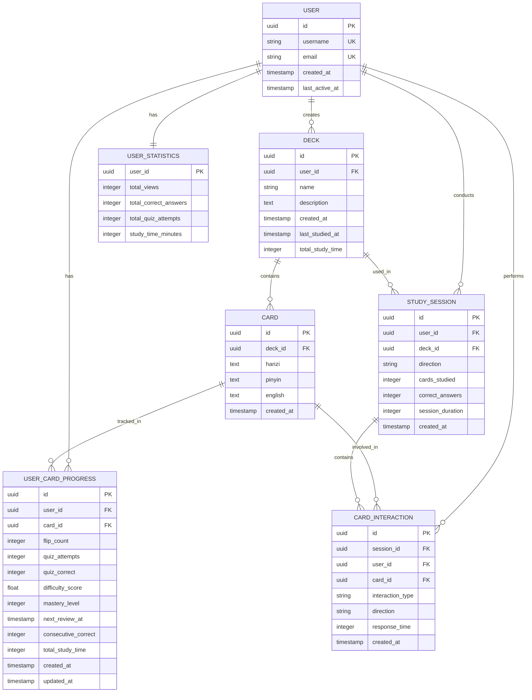
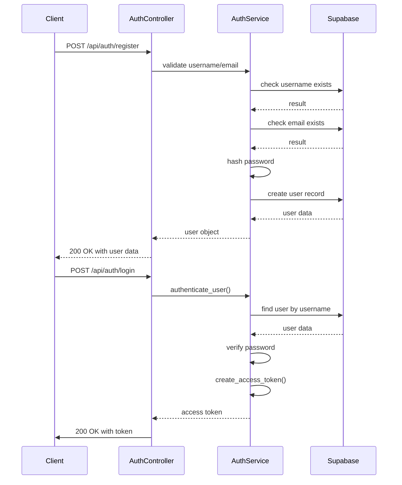

# Technology Stack & Dependencies

This document provides a comprehensive overview of the technology stack, frameworks, and dependencies used in the Chinese Flashcards application.

## Table of Contents
1. [Introduction](#introduction)
2. [Core Frameworks and Libraries](#core-frameworks-and-libraries)
3. [Dependency Management](#dependency-management)
4. [Database and ORM](#database-and-orm)
5. [Authentication and Security](#authentication-and-security)
6. [Data Processing and Validation](#data-processing-and-validation)
7. [Server and Runtime Environment](#server-and-runtime-environment)
8. [Integration and Dependency Injection](#integration-and-dependency-injection)
9. [Common Issues and Best Practices](#common-issues-and-best-practices)

## Introduction

The flashcards application is a modern web application built with Python and FastAPI, designed for learning Chinese vocabulary through interactive flashcards. The technology stack combines several key frameworks and libraries to provide a robust, scalable, and maintainable solution. This document details the critical components of the technology stack, explaining the role of each dependency, their integration points, and how they work together to deliver the application's functionality. The analysis covers version compatibility, installation methods, Docker encapsulation, and practical examples of dependency injection and service initialization.

## Core Frameworks and Libraries

### FastAPI Framework
FastAPI serves as the foundation of the application, providing:
- **Automatic API documentation** with OpenAPI/Swagger
- **High performance** comparable to NodeJS and Go
- **Type hints integration** with Python 3.6+ annotations
- **Async/await support** for non-blocking operations
- **Dependency injection** system for clean architecture

```python
from fastapi import FastAPI, Depends
from fastapi.middleware.cors import CORSMiddleware

app = FastAPI(
    title="Chinese Flashcards API",
    description="Interactive flashcard learning system",
    version="1.0.0"
)
```

### Supabase Integration
Supabase provides backend-as-a-service functionality including:
- **PostgreSQL database** with real-time capabilities
- **Authentication and authorization** services
- **Row-level security** for data protection
- **RESTful API** auto-generation from database schema

## Database and ORM

### Database Models and Relationships

The application uses SQLAlchemy ORM with Supabase (PostgreSQL) as the backend database. The complete entity-relationship diagram shows how all models interact:



## Authentication and Security

### Authentication Flow and JWT Implementation
The authentication system follows a standard JWT-based approach with registration, login, and protected routes. The flow begins with user registration, where username and email uniqueness are verified before creating a new user with a hashed password.



### Pydantic for Data Validation and Settings
Pydantic is used extensively for data validation, serialization, and settings management. The application defines Pydantic models for API request and response schemas in `app/schemas/schemas.py`, ensuring type safety and automatic validation.

The `Settings` class in `app/core/config.py` inherits from `BaseSettings`, loading configuration values from environment variables and the `.env` file. This approach centralizes configuration management and supports different settings for development, testing, and production environments.

```python
class Settings(BaseSettings):
    supabase_url: str
    supabase_service_key: str
    supabase_anon_key: str
    secret_key: str
    algorithm: str = "HS256"
    access_token_expire_minutes: int = 30
    environment: str = "development"
    debug: bool = False
    allowed_origins: List[str] = ["http://localhost:3000", "http://localhost:8080"]
    
    class Config:
        env_file = ".env"
        env_file_encoding = "utf-8"
```

The `@lru_cache()` decorator on the `get_settings()` function ensures settings are loaded once and cached for subsequent requests, improving performance.

## Data Processing and Validation

### CSV Import/Export with Pandas
The application supports bulk data operations through CSV import and export functionality, implemented using pandas for efficient data processing.

### Pydantic Schemas for API Validation
Pydantic schemas define the structure of API requests and responses, ensuring data consistency and automatic validation. The schemas in `app/schemas/schemas.py` include models for users, decks, cards, authentication, and tokens.

For example, the `UserCreate` schema validates user registration data:

```python
class UserCreate(BaseModel):
    username: str = Field(..., min_length=3, max_length=50)
    email: EmailStr
    password: str = Field(..., min_length=8)
```

This ensures that usernames are between 3-50 characters, emails are valid, and passwords are at least 8 characters long. FastAPI automatically validates incoming requests against these schemas and returns appropriate error messages for invalid data.

## Server and Runtime Environment

### Uvicorn ASGI Server
The application runs on Uvicorn, a lightning-fast ASGI server implementation, providing:
- **High performance** async request handling
- **WebSocket support** for real-time features
- **Auto-reload** during development
- **Production-ready** deployment capabilities

### Python Version Requirements
- **Python 3.13.3** (confirmed during setup)
- **Async/await support** for non-blocking operations
- **Type hints** for better code documentation and IDE support

## Integration and Dependency Injection

### Service Initialization and Architecture
The application follows a service-oriented architecture, with dedicated services for different domains:

- `UserService`: User management and profile operations
- `DeckService`: Deck creation, retrieval, and management
- `CardService`: Card operations within decks
- `CsvService`: CSV import/export functionality
- `LearningService`: Adaptive learning algorithm implementation
- `StudyService`: Study session management
- `StatisticsService`: Learning analytics and statistics

These services are initialized through dependency functions that provide properly configured instances to route handlers. For example, the `get_deck_service` dependency:

```python
def get_deck_service() -> DeckService:
    """Dependency to get deck service"""
    return DeckService(
        get_async_session(),
        get_supabase_client()
    )
```

This approach enables loose coupling between components and facilitates testing by allowing dependencies to be easily mocked.

## Common Issues and Best Practices

### Dependency Management
- Use `requirements.txt` for explicit dependency management
- Pin versions for production deployments
- Regular security updates for all dependencies

### Configuration Management
- Use environment variables for sensitive configuration
- Implement proper validation for configuration values
- Separate development and production configurations

### Performance Optimization
- Leverage FastAPI's async capabilities
- Implement proper database connection pooling
- Use caching strategies for frequently accessed data

**Referenced Files:**
- [app/core/config.py](../app/core/config.py)
- [app/core/database.py](../app/core/database.py)
- [app/models/database.py](../app/models/database.py)
- [app/schemas/schemas.py](../app/schemas/schemas.py)
- [requirements.txt](../requirements.txt)